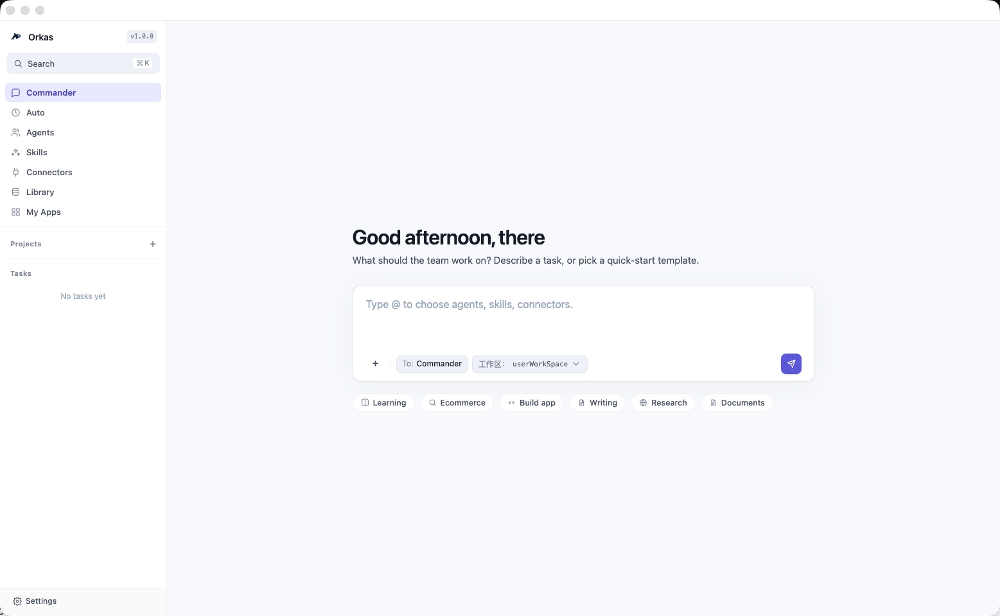

# Orkas

**Command a team of AI agents from one chat — not a single chatbot.**

Orkas is an open-source, local-first desktop app: a capable **commander agent** does the work itself and directs specialized sub-agents, all with your own LLM keys. Fully offline-capable. macOS · Windows · Linux.

[](./LICENSE)
[](https://github.com/Orkas-AI/Orkas/stargazers)
[](https://orkas.ai)
[](https://orkas.ai)
[](https://discord.gg/K8Eyvu7rD)
[](https://x.com/leochenpm)

[English](./README.md) · [简体中文](./README.zh-CN.md)


> One capable commander agent — with the strengths of a coding agent — does the work itself and directs a team of specialized sub-agents, all by conversation. No flowcharts, no orchestration code. Your conversations, files, and API keys never leave your machine.

---

## What is Orkas?

- **What it is** — a desktop GUI app where you command a *team* of specialized AI agents through one chat. Not a single chatbot, not a code framework, not a hosted SaaS.
- **A commander that does, not just delegates** — the lead agent brings coding-agent strengths (precise file edits, careful tool use, engineering discipline, multi-step and long-horizon reasoning) and does the work itself; when a job needs a team, it assembles sub-agents to run in parallel or in series.
- **Drives the open-source ecosystem** — plug in external CLI coding agents (Claude Code, Codex, OpenCode, Cline) and onboard open-source projects like HyperFrames as local tools — so one commander can deliver code, research, data, video, and slides.
- **Local-first** — conversations, files, API keys, knowledge bases, and custom agents all stay on your disk. Model calls go straight from your machine to the provider — never through Orkas servers.
- **Bring your own LLM keys** — plug in Claude, OpenAI, Gemini, DeepSeek, Kimi, GLM, Qwen, MiniMax, or Doubao. Mix providers across agents. No vendor lock-in.
- **Self-evolving** — each agent has its own private skills and memory, and improves through reflection after each task.

> ⭐ If Orkas is useful to you, a star helps more people find the project.

---

## What can you build with it?

- **Automate recurring reports & market research** — a sub-agent that gathers, summarizes, and ships a weekly report.
- **Turn a product spec into dev tasks** — the commander breaks a PRD into tasks and dispatches them across agents.
- **Chat with your documents & run local data analysis** — drop files in, keep the data on your machine.
- **Go beyond code — video, slides, and more** — the commander drives open-source tools like HyperFrames and hands off to CLI coding agents (Claude Code, Codex, OpenCode, Cline) and other local agents, so one chat produces code, research, video, and slide decks.

**Explore use cases →** [research workflows](https://orkas.ai/use/researchers) · [data analysis](https://orkas.ai/use/data-analysis) · [chat with documents](https://orkas.ai/use/chat-with-documents) · [for developers](https://orkas.ai/use/developers) · [automate your workspace](https://orkas.ai/use/automate-workspace)

---

## Download

- **Get the app** → [orkas.ai](https://orkas.ai) (macOS · Windows installers)
- **Run from source** → see [Quick start](#quick-start) below

---

## How Orkas compares

| Tool | What it is | How Orkas differs |
| --- | --- | --- |
| **LangChain** | A developer framework/library for building LLM apps and agents — code-first, embedded in your own Python/JS app. | Orkas is a **no-code desktop GUI**: you assemble and command a team of agents through chat, not by writing orchestration code. Data and keys stay local by default. |
| **CrewAI** | A Python framework for orchestrating role-playing autonomous agents — you define crews and agents in code. | Orkas gives you the same multi-agent orchestration **without code**, in a desktop app, with **local-first storage** and per-agent self-evolution built in. |
| **Cloud agent platforms** (SaaS orchestrators) | Server-hosted; conversations, files, and API keys live on the vendor's infrastructure. | Orkas is **local-first**: everything stays on your machine, and model API calls go straight to the provider — never archived by Orkas. |
| **OpenClaw** | A single always-on personal assistant reaching you across messaging channels. | Orkas builds a *team* of specialized agents directed from one desktop chat — and OpenClaw plugs in as an Orkas CLI backend. |
| **Hermes-Agent** | Nous Research's self-improving personal agent (TUI + multi-channel gateway). | Orkas is desktop-GUI and team-shaped, with per-agent private skills and meta-cognition — and Hermes-Agent plugs in as an Orkas CLI backend. |

**Orkas is for you if** you want a *team* of agents (not one assistant), a desktop GUI with file drop-in and visual agent management, and your data, keys, and agents on your own disk rather than a vendor cloud.

**Not for you if** you just want a single all-purpose chatbot, a fully hosted/cloud team where your data lives on a vendor's servers, or a pure code library to embed in your own app.

**Full side-by-side comparisons →** [vs Claude Code](https://orkas.ai/compare/orkas-vs-claude-code) · [vs Cline](https://orkas.ai/compare/orkas-vs-cline) · [vs LangChain](https://orkas.ai/compare/orkas-vs-langchain) · [vs ChatGPT](https://orkas.ai/compare/orkas-vs-chatgpt) · [vs OpenClaw](https://orkas.ai/compare/orkas-vs-openclaw)

---

## FAQ

**What is Orkas?**
A local-first desktop app where you command a team of AI agents from one chat. A capable commander agent does the work itself and directs specialized sub-agents — not a single chatbot, not a code framework, not a hosted SaaS.

**Is Orkas a local LLM?**
No. Orkas runs on your machine but calls the models you choose through your own API keys (or a local model endpoint). It orchestrates agents and tools — it is not itself a model.

**Where are my API keys and data stored?**
On your disk. Conversations, files, knowledge bases, agents, and keys stay local; model calls go straight from your machine to the provider and are never proxied or archived by Orkas.

**Does Orkas work offline?**
The app is fully offline-capable — only the model calls need network. Point agents at a local model endpoint and you can run without the cloud.

**Can Orkas drive Claude Code and other CLI coding agents?**
Yes. Beyond its own commander and sub-agents, Orkas can drive external CLI coding agents — Claude Code, Codex, OpenCode, Cline — as local subprocesses, and onboard open-source projects like HyperFrames, all directed from the same chat.

**How is Orkas different from Claude Desktop / CrewAI / LangChain?**
Claude Desktop is a single assistant; CrewAI and LangChain are code-first frameworks. Orkas is a no-code desktop app that commands a *team* of agents, keeps data and keys local, and gives each agent its own private skills and memory. See the [full comparisons](https://orkas.ai/compare/orkas-vs-langchain).

**Is Orkas free and open source?**
Yes — MIT licensed. Bring your own model keys; you only ever pay your model providers.

---

## Quick start

Prefer the packaged app? Use the production installer links:

- **macOS Apple Silicon** -> [Orkas-mac-arm64.dmg](https://orkas-sg-1367889399.cos.ap-singapore.myqcloud.com/public/products/mac/latest/Orkas-mac-arm64.dmg)
- **macOS Intel** -> [Orkas-mac-x64.dmg](https://orkas-sg-1367889399.cos.ap-singapore.myqcloud.com/public/products/mac/latest/Orkas-mac-x64.dmg)
- **Windows x64** -> [Orkas-Setup.exe](https://orkas-sg-1367889399.cos.ap-singapore.myqcloud.com/public/products/win/latest/Orkas-Setup.exe)

To run from source:

**Requirements**: Node 20+ · Python 3 · macOS / Windows 10+ / recent Linux

```bash
git clone https://github.com/Orkas-AI/Orkas.git
cd Orkas
./run.sh           # macOS / Linux
run.cmd            # Windows
```

`run.sh` / `run.cmd` auto-installs dependencies and downloads the embedding model (~95 MB). First launch creates a workspace under `~/.orkas/` (macOS / Linux) or `<smallest non-system drive>:\.orkas\` (Windows). Then open **Settings → AI Providers** to add an API key or OAuth.

---

## Screenshots



---

## How it works (core design)

> Full design and hard constraints → [`CLAUDE.md`](./CLAUDE.md)

### Group chat: visibility slicing + a single scheduling primitive

In one chat there's a commander, N agents, and you — but **each agent does not see the same conversation**.

- **Visibility slicing** — the main conversation is one full jsonl; each agent only gets a slice (`from==me ∨ to∋me ∨ mentions∋me`). A worker never reads the full main conversation — saves tokens and prevents private context from leaking across agents.
- **One scheduling primitive** — every dispatch (the commander's `dispatch_to`, the user's `@`, plan steps) funnels into the same `enqueue` primitive. No parallel routing paths.
- **Shared plan** — when agents collaborate, the commander writes progress into one `plan.md`, visible to every member.

### Agent dispatch: structured channels, not `@` in prose

- **Structured dispatch** — commander↔agent dispatches go through the `dispatch_to({to, message})` tool call; `@` in prose is not treated as a dispatch signal (the user's `@` is still recognized — UX unchanged).
- **Deferred wake-up** — a `dispatch_to` only stages; the recipient wakes only after the commander's turn finishes, preventing premature execution.
- **Turn-based safety stop** — the runaway guard counts turns (`MAX_WORKER_TURNS=100`), not wall-clock time, so a slow-but-progressing LLM isn't killed.

### Self-evolution: `meta/` + self-managed skills

Each agent maintains, in its own directory:

- **`meta/COMPETENCE.md`** — what it's good / not good at.
- **`meta/LEARNING_STRATEGIES.md`** — methods that have worked for it.

After each task the agent reflects and updates these; on the next task `meta/` is fed back into the system prompt, so experience shapes the next run. Via the `skill_manage` tool an agent can also crystallize "how I solved X" into a **private** skill, reused directly next time.

---

## Acknowledgments

Some core modules draw on these open-source projects — special thanks to:

- [OpenClaw](https://github.com/openclaw/openclaw)
- [Hermes-Agent](https://github.com/NousResearch/hermes-agent)

---

## License

[MIT](./LICENSE)
