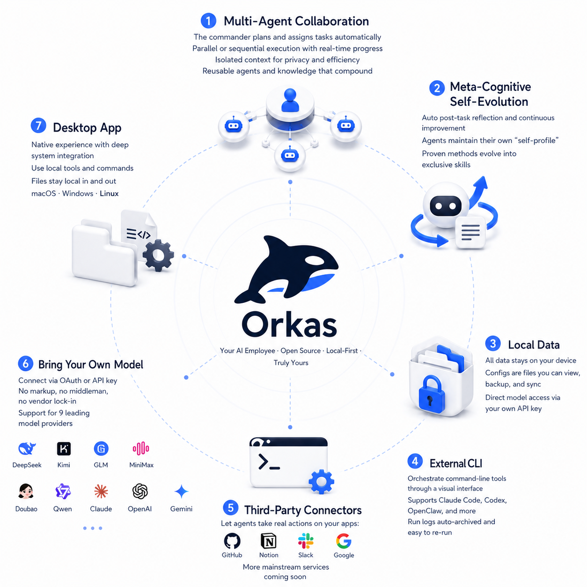

# Orkas — Open-Source Multi-Agent AI Desktop Client, Build and command your AI agent team through conversation

**Open-source multi-agent AI desktop client for AI workflow orchestration. Build your AI team in one chat: a commander LLM assembles an agent team, dispatches sub-agents in parallel or in series, and lets agents self-evolve through reflection and skill crystallization. Local-first storage, BYO LLM API keys (Claude · OpenAI · Gemini · DeepSeek · Kimi · GLM · Qwen · MiniMax · Doubao), cross-platform on macOS, Windows, and Linux. A no-code, GUI-native team layer for local agents — OpenClaw, Hermes-Agent, Claude Code, Codex, and other local CLI agents all plug in seamlessly.**

[English](./README.md) · [简体中文](./README.zh-CN.md)

> **Your AI workforce · Open · Local · Yours forever**
>
> AI learns how you work · Stays private · Pays you back later

**Multi-agent collaboration · Self-evolving agents · Local-first storage · Cross-platform desktop app**

🌐 Want multi-device sync, remote control, team collaboration, and more? → [Commercial edition](https://orkas.ai)

> ⭐ If Orkas helps you build better AI workflows, please consider giving it a star — it helps more people find the project.

---

## Core features



---

## Screenshots


---

## Core design

> Full design and hard constraints → [`CLAUDE.md`](./CLAUDE.md)

### Group chat: visibility slicing + a single scheduling primitive

In one chat there's a commander, N agents, and you — but **each agent does not see the same conversation**.

- **Visibility slicing** — the main conversation is one full jsonl; each agent only gets a slice in its own `visibility/<aid>.jsonl`: `from==me ∨ to∋me ∨ mentions∋me`. The worker only reads its own slice and **never the full main conversation** — saves tokens and prevents private context from leaking across agents
- **One scheduling primitive** — every dispatch (the commander's `dispatch_to`, the user's `@` in text, steps split out from a plan) funnels into the same `enqueue` primitive. No parallel routing paths. Any new dispatch path must go through it, to avoid scattered "who-can-wake-whom" rules
- **Shared plan** — when multiple agents collaborate, the commander writes the progress into one `plan.md`, visible to every member

### Agent dispatch: structured channels, not `@` in prose

LLMs love using `@` as a markdown decoration — recognizing `@` in prose as a dispatch signal triggers false positives over and over. So:

- **Structured dispatch** — dispatches between commander and agents must go through the `dispatch_to({to, message})` tool call (a structured channel); `@` in prose is not recognized as a dispatch signal (the user's `@` is still text-recognized — user UX unchanged)
- **Deferred wake-up** — a `dispatch_to` call only stages; the recipient worker is woken up only after the commander's current turn finishes, preventing premature execution
- **Turn-based safety stop** — the runaway-loop guard counts turns (`MAX_WORKER_TURNS=100`), not wall-clock time. A slow LLM that's making progress isn't a runaway loop

### Meta-cognition: `meta/` + self-managed skills

Each agent maintains two kinds of self-knowledge in its own directory, written by the agent itself:

- **`meta/COMPETENCE.md`** — what I'm good at / not good at
- **`meta/LEARNING_STRATEGIES.md`** — methods that have worked for me

After each task, the agent reflects and updates these two files; on the next task, `meta/` is fed in as part of the system prompt, **so experience actually shapes the next run**.

The other evolution path is the `skill_manage` tool: an agent can crystallize "this is how I solved X" into a skill that **only belongs to itself** (a private SkillStore, independent of the global skill library). The next similar task calls it directly — no need to re-derive it every time.

---

## Why Orkas?

Orkas isn't a single personal AI assistant that follows you across messaging channels, and isn't a hosted SaaS — it's a desktop app where you assemble a team of specialized agents and command them through one chat.

| Tool | What it is | Where Orkas differs |
| --- | --- | --- |
| **OpenClaw** | A personal AI assistant you run on your own devices, reaching you across the messaging channels you already use. Single-user, always-on, channel-native. | Orkas is a desktop multi-agent client: instead of one assistant on every channel, you build a team of specialized agents and direct them through a single desktop chat — visibility-sliced collaboration, a shared `plan.md`, and per-agent self-evolution. OpenClaw also plugs in as an Orkas CLI backend, so an Orkas agent can hand work off to your OpenClaw. |
| **Hermes-Agent** | Nous Research's self-improving personal AI agent — a TUI plus multi-channel gateway, with a built-in learning loop, scheduled automations, and the ability to run on a cheap VPS or serverless infra. | Orkas is desktop-GUI and team-shaped: a commander LLM dispatches a *team* of agents in parallel or in series through one chat; each agent has its own private skill library and meta-cognition, and the entire stack runs locally on your machine. Hermes-Agent is also pluggable as an Orkas CLI backend. |
| **Cloud agent platforms** (SaaS multi-agent orchestrators) | Server-hosted; conversations, files, and API keys live on the vendor's infrastructure. | Orkas is local-first: conversations, files, API keys, knowledge bases, custom agents / skills / memory all stay on your machine. Model API calls go straight from your machine to the provider — never through Orkas servers, and never archived. |

**Orkas is for you if**: you want a *team* of agents, not a single personal assistant; you want a desktop GUI with file drop-in and visual agent management; and you want your data, keys, and agents on your own disk rather than in a vendor cloud.

---

## Quick start

**Requirements**: Node 20+ · Python 3 · macOS / Windows 10+ / recent Linux

```bash
git clone https://github.com/Orkas-AI/Orkas.git
cd Orkas
./run.sh           # macOS / Linux
run.cmd            # Windows
```

`run.sh` / `run.cmd` auto-installs dependencies and downloads the embedding model (~95 MB). First launch creates a workspace under `~/.orkas/` (macOS / Linux) or `<smallest non-system drive>:\.orkas\` (Windows). Then go to **Settings → AI Providers** to configure an API key or OAuth.

> ⭐ Got Orkas running? A star on the repo goes a long way toward keeping the project moving.

---

## Acknowledgments

Some core modules in this project draw on the following open-source projects — special thanks to:

- [OpenClaw](https://github.com/openclaw/openclaw)
- [Hermes-Agent](https://github.com/NousResearch/hermes-agent)

---

## License

[MIT](./LICENSE)
