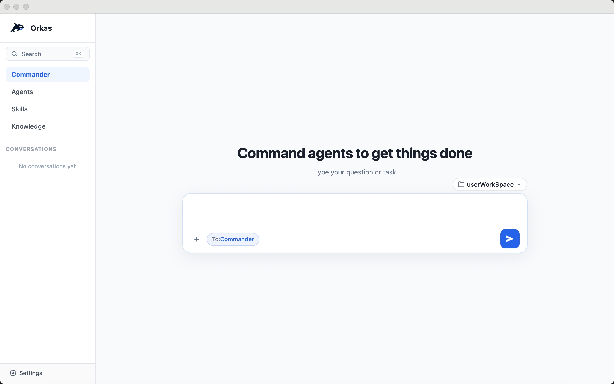
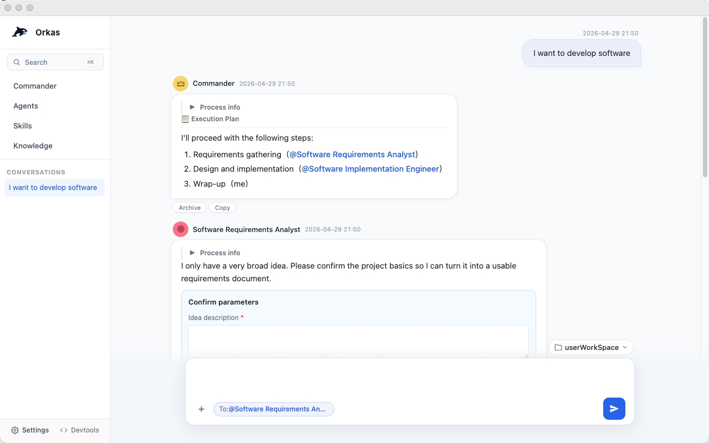
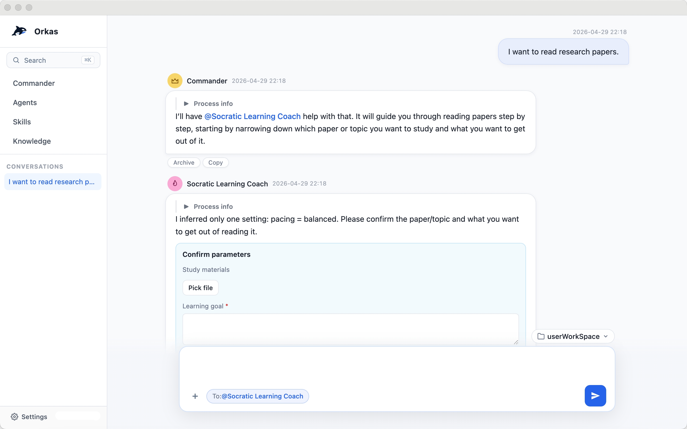
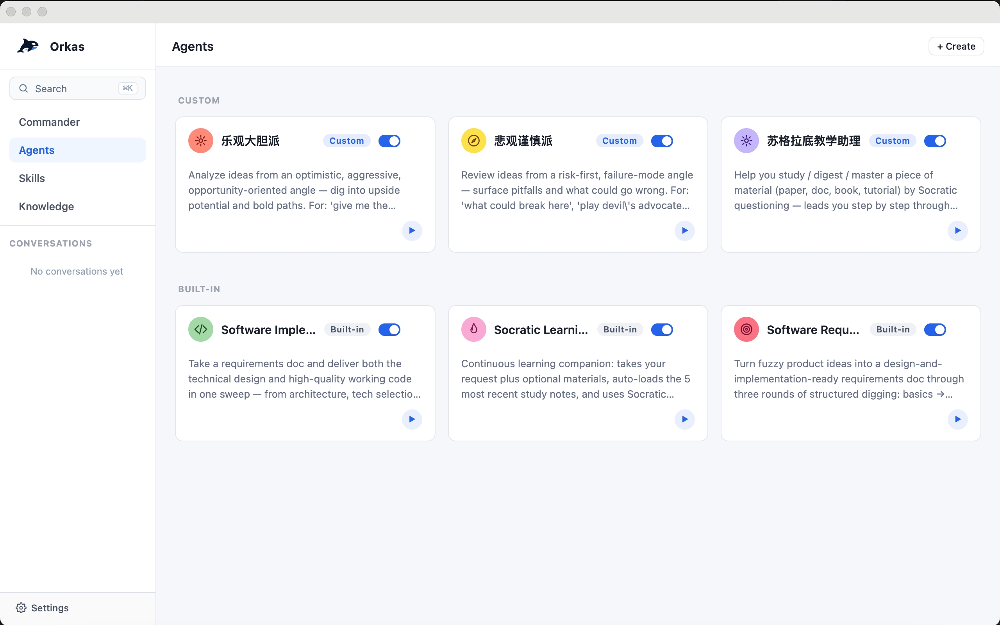
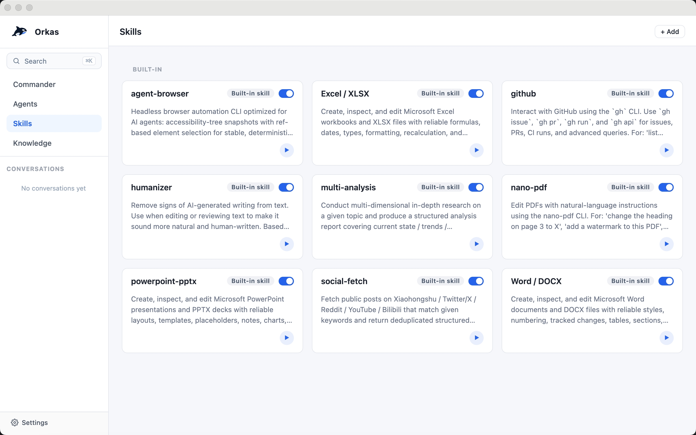

# Orkas — Open-Source Multi-Agent AI Desktop Client, Build and command your AI agent team through conversation

**Open-source multi-agent AI desktop client for AI workflow orchestration. Build your AI team in one chat: a commander LLM assembles an agent team, dispatches sub-agents in parallel or in series, and lets agents self-evolve through reflection and skill crystallization. Local-first storage, BYO LLM API keys (Claude · OpenAI · Gemini · DeepSeek · Kimi · GLM · Qwen · MiniMax · Doubao), cross-platform on macOS, Windows, and Linux. A no-code, GUI-native team layer for local agents — OpenClaw, Hermes-Agent, Claude Code, Codex, and other local CLI agents all plug in seamlessly.**

[English](./README.md) · [简体中文](./README.zh-CN.md)

> Command your AI team through conversation — made for people who want a team, not a chat box.

**Multi-agent collaboration · Self-evolving agents · Local-first storage · Cross-platform desktop app**

<sub>multi-agent system · AI team · agent team · AI workflow · agents orchestration</sub>

🌐 Want team collaboration, expert agents, and more? → [Pro edition](https://aiservice.fun)

---

## Four core points

### 👥 Multi-agent collaboration

**A whole team in one chat window** — the commander dispatches, agents handle their specialties, you just talk.

- **Smart dispatch** — the commander has the full conversation context and decides on its own who to bring in and when, based on your needs and each agent's strengths
- **Orchestrated collaboration** — multiple agents work in serial or in parallel within the same chat; task breakdown, hand-offs between agents, and result aggregation are all orchestrated by the commander
- **Quickly create new agents** — describe one to the commander, or have it distill one from your past chats — it produces a reusable agent you can summon next time
- **Step in anytime** — `@` any member to add requirements, redirect, or pull someone in / kick them out

### 🌱 Self-evolving agents

**Agents that get to know your work better the more you use them** — after each task, an agent reflects on how it did and how to do better next time, and accumulates experience over time.

- **Reflective evolution** — after self-reflection, an agent updates its own playbook: what it's good at / not good at, and which methods work in which situations
- **Skill crystallization** — the moves that worked this time get crystallized into a reusable skill, so the next similar task picks it up directly
- **Private knowledge** — each agent has its own private skill library and memory, never crossed over from other agents

### 💾 Local storage

**Conversations, files, API keys, knowledge bases, custom agents / skills, memory — all stay on your machine.**

- **Offline-capable** — except for the moment of calling the model API, everything else still runs with the network off
- **Config is just files** — all data is plain files: readable, backupable, syncable through your own cloud drive; migrating machines is just copying a directory

### 🖥️ Desktop app

**As a desktop app, local file handling is smooth and the GUI beats the command line.**

- **Direct local file access** — drop files into the chat as attachments; agents can read and write files in your workspace, run scripts, and generate PDFs / images / code; produced files appear as cards in the chat, one click to reveal in Finder / Explorer
- **Visual operations** — agents, skills, and knowledge bases are all managed visually; view images, videos, and generated documents directly in the chat without switching to a CLI
- **Use your own subscription or API key** — log in via OAuth or paste an API key for DeepSeek · Kimi · GLM · MiniMax · Doubao · Qwen · Claude · OpenAI · Gemini; requests don't go through Orkas and aren't archived
- **Cross-platform** — macOS (Apple Silicon + Intel), Windows, and Linux

---

## Screenshots

| <br>**Commander dispatch** | <br>**Parallel agent collaboration** |
|:---:|:---:|
| <br>**Serial agent collaboration** | <br>**Agent management** |
| <br>**Skill library** | |

---

## Core design

> Full design and hard constraints → [`CLAUDE.md`](./CLAUDE.md)

### Group chat: visibility slicing + a single scheduling primitive

In one chat there's a commander, N agents, and you — but **each agent does not see the same conversation**.

- **Visibility slicing** — the main conversation is one full jsonl; each agent only gets a slice in its own `visibility/<aid>.jsonl`: `from==me ∨ to∋me ∨ mentions∋me`. The worker only reads its own slice and **never the full main conversation** — saves tokens and prevents private context from leaking across agents
- **One scheduling primitive** — every dispatch (the commander's `dispatch_to`, the user's `@` in text, steps split out from a plan) funnels into the same `enqueue` primitive. No parallel routing paths. Any new dispatch path must go through it, to avoid scattered "who-can-wake-whom" rules
- **Shared plan** — when multiple agents collaborate, the commander writes the progress into one `plan.md`, visible to every member

### Agent dispatch: structured channels, not `@` in prose

LLMs love using `@` as a markdown decoration — recognizing `@` in prose as a dispatch signal triggers false positives over and over. So:

- **Structured dispatch** — dispatches between commander and agents must go through the `dispatch_to({to, message})` tool call (a structured channel); `@` in prose is not recognized as a dispatch signal (the user's `@` is still text-recognized — user UX unchanged)
- **Deferred wake-up** — a `dispatch_to` call only stages; the recipient worker is woken up only after the commander's current turn finishes, preventing premature execution
- **Turn-based safety stop** — the runaway-loop guard counts turns (`MAX_WORKER_TURNS=100`), not wall-clock time. A slow LLM that's making progress isn't a runaway loop

### Meta-cognition: `meta/` + self-managed skills

Each agent maintains two kinds of self-knowledge in its own directory, written by the agent itself:

- **`meta/COMPETENCE.md`** — what I'm good at / not good at
- **`meta/LEARNING_STRATEGIES.md`** — methods that have worked for me

After each task, the agent reflects and updates these two files; on the next task, `meta/` is fed in as part of the system prompt, **so experience actually shapes the next run**.

The other evolution path is the `skill_manage` tool: an agent can crystallize "this is how I solved X" into a skill that **only belongs to itself** (a private SkillStore, independent of the global skill library). The next similar task calls it directly — no need to re-derive it every time.

---

## Why Orkas?

Orkas isn't a single personal AI assistant that follows you across messaging channels, and isn't a hosted SaaS — it's a desktop app where you assemble a team of specialized agents and command them through one chat.

| Tool | What it is | Where Orkas differs |
| --- | --- | --- |
| **OpenClaw** | A personal AI assistant you run on your own devices, reaching you across the messaging channels you already use. Single-user, always-on, channel-native. | Orkas is a desktop multi-agent client: instead of one assistant on every channel, you build a team of specialized agents and direct them through a single desktop chat — visibility-sliced collaboration, a shared `plan.md`, and per-agent self-evolution. OpenClaw also plugs in as an Orkas CLI backend, so an Orkas agent can hand work off to your OpenClaw. |
| **Hermes-Agent** | Nous Research's self-improving personal AI agent — a TUI plus multi-channel gateway, with a built-in learning loop, scheduled automations, and the ability to run on a cheap VPS or serverless infra. | Orkas is desktop-GUI and team-shaped: a commander LLM dispatches a *team* of agents in parallel or in series through one chat; each agent has its own private skill library and meta-cognition, and the entire stack runs locally on your machine. Hermes-Agent is also pluggable as an Orkas CLI backend. |
| **Cloud agent platforms** (SaaS multi-agent orchestrators) | Server-hosted; conversations, files, and API keys live on the vendor's infrastructure. | Orkas is local-first: conversations, files, API keys, knowledge bases, custom agents / skills / memory all stay on your machine. Model API calls go straight from your machine to the provider — never through Orkas servers, and never archived. |

**Orkas is for you if**: you want a *team* of agents, not a single personal assistant; you want a desktop GUI with file drop-in and visual agent management; and you want your data, keys, and agents on your own disk rather than in a vendor cloud.

---

## Quick start

**Requirements**: Node 20+ · Python 3 · macOS / Windows 10+ / recent Linux

```bash
git clone https://github.com/Orkas-AI/Orkas.git
cd Orkas
./run.sh           # macOS / Linux
run.cmd            # Windows
```

`run.sh` / `run.cmd` auto-installs dependencies and downloads the embedding model (~95 MB). First launch creates a workspace under `~/.orkas/` (macOS / Linux) or `<smallest non-system drive>:\.orkas\` (Windows). Then go to **Settings → AI Providers** to configure an API key or OAuth.

---

## Acknowledgments

Some core modules in this project draw on the following open-source projects — special thanks to:

- [OpenClaw](https://github.com/openclaw/openclaw)
- [Hermes-Agent](https://github.com/NousResearch/hermes-agent)

---

## License

[MIT](./LICENSE)
