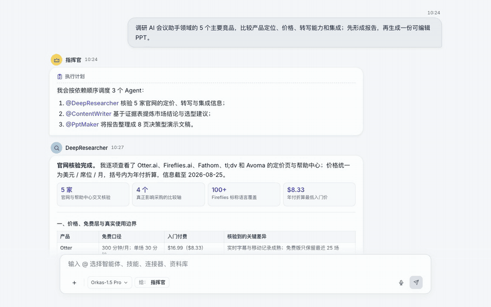
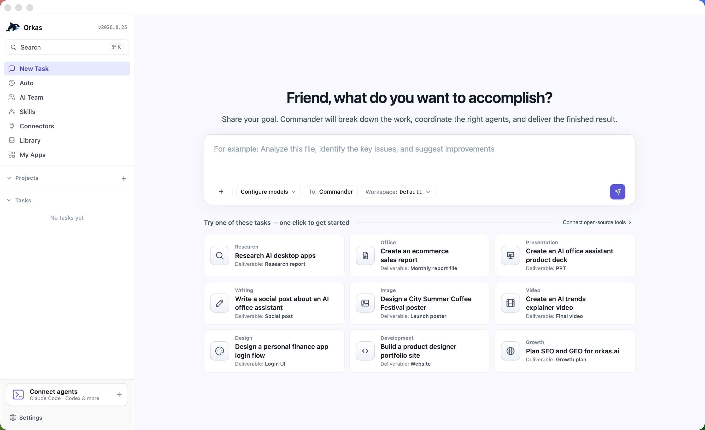

# Orkas

**Command a team of AI agents from one desktop chat — not one chatbot.**

Orkas is an open-source, local-first multi-agent desktop app. Describe a goal; its **Commander** plans the work, handles the general parts itself, and coordinates specialist agents in parallel or in sequence. **Nine specialist agents ship with the app**, ready the moment you launch it, out of 30 in the marketplace. Bring your own model keys — Claude · OpenAI · Gemini · DeepSeek · Kimi · GLM · Qwen · MiniMax · Doubao. macOS · Windows · Linux.

[](./LICENSE)
[](https://github.com/Orkas-AI/Orkas/stargazers)
[](https://github.com/Orkas-AI/Orkas/releases)
[](https://orkas.ai?source=gh-orkas)
[](https://orkas.ai?source=gh-orkas)
[](https://x.com/leochenpm)

[English](./README.md) · [简体中文](./README.zh-CN.md)

---

**You:** *"Research the top 5 competitors, write it up, and turn it into a deck."*

**Orkas:** the Commander breaks the goal into steps and runs them across specialists — **DeepResearcher** gathers and verifies the sources, **ContentWriter** drafts the report, **PptMaker** builds the slides. One chat, one shared plan, finished files on your disk.



---

## Agents that ship with the app

Installed and ready the first time you launch Orkas — each with its own skills, memory, and tools.

| Agent | What it does |
| --- | --- |
| **DeepResearcher** | Evidence-grounded research — plans the investigation, verifies sources, flags contradictions, ships an auditable report with citations |
| **ContentWriter** | Turns a goal, source material, or a rough draft into publish-ready posts, articles, newsletters, and case studies |
| **PptMaker** | Turns a topic, outline, or document into an attractive, editable, reviewable PPTX deck |
| **ProductDeveloper** | Repo-aware engineering — implement a PRD, fix bugs, refactor, review code, with verifiable results |
| **OfficeWorker** | Create, edit, check, and deliver Word / Excel / PowerPoint / PDF files, one at a time or in batches |
| **VideoStudio** | Make and edit video — narration, AI presenters, captions and dubbing, highlight clips, localization |
| **ImageStudio** | Posters, covers, social images, infographics — HTML/CSS/SVG first, image models when the shot needs them |
| **UIDesigner** | Product goals, PRDs, screenshots, or Figma material into editable, HTML-first UI deliverables |
| **SeoGeoAgent** | Give it a URL — technical audit, content quality, Core Web Vitals, GEO citability, health score, ranked fix list |

**More on the built-in agents →** [orkas.ai/agents](https://orkas.ai/agents/?source=gh-orkas) · **Browse all 30 →** [agent marketplace](https://orkas.ai/views/marketplace/gs/agents/?source=gh-orkas) · or just describe what you need and the Commander builds a custom agent for you.

---

## Why Orkas

- **A super-powered Commander** — understands context, breaks down goals, chooses the right agents, skills, connectors, and tools, and directly handles analysis, writing, research, file work, and automation when no specialist is a better fit.
- **Drives the open-source ecosystem** — plug in external CLI coding agents (Claude Code, Codex, OpenCode, Cline) and onboard open-source projects like HyperFrames as local tools, all coordinated by the same Commander.
- **Local-first by design** — conversations, files, API keys, knowledge bases, and custom agents all stay on your disk. Model calls go straight from your machine to the provider — never through Orkas servers.
- **No vendor lock-in** — mix providers across agents: one on Claude, another on DeepSeek, another on a local endpoint.
- **Agents that get better** — each agent has its own private skills and memory, and improves through reflection after each task.

> ⭐ If Orkas is useful to you, a star helps more people find the project.

---

## Download

Packaged installers for macOS and Windows. Linux runs from source today — see [Quick start](#quick-start).

- **macOS Apple Silicon** → [Orkas-mac-arm64.dmg](https://orkas.ai/download/?source=gh-orkas&entry_point=github_readme&os=mac&arch=arm64&download=1)
- **macOS Intel** → [Orkas-mac-x64.dmg](https://orkas.ai/download/?source=gh-orkas&entry_point=github_readme&os=mac&arch=x64&download=1)
- **Windows x64** → [Orkas-Setup.exe](https://orkas.ai/download/?source=gh-orkas&entry_point=github_readme&os=win&download=1)

---

## What can you build with it?

- **Automate recurring reports & market research** — a specialist agent gathers, summarizes, and ships a weekly report.
- **Turn a product spec into dev tasks** — the Commander breaks a PRD into tasks and dispatches them across agents.
- **Chat with your documents & run local data analysis** — drop files in, keep the data on your machine.
- **Go beyond code — video, slides, and more** — the Commander drives open-source tools like HyperFrames and hands off to CLI coding agents (Claude Code, Codex, OpenCode, Cline) and other local agents, so one chat produces code, research, video, and slide decks.

**Explore use cases →** [research workflows](https://orkas.ai/use/researchers?source=gh-orkas) · [data analysis](https://orkas.ai/use/data-analysis?source=gh-orkas) · [chat with documents](https://orkas.ai/use/chat-with-documents?source=gh-orkas) · [for developers](https://orkas.ai/use/developers?source=gh-orkas) · [automate your workspace](https://orkas.ai/use/automate-workspace?source=gh-orkas)

---

## How Orkas compares

| Tool | What it is | How Orkas differs |
| --- | --- | --- |
| **LangChain** | A developer framework/library for building LLM apps and agents — code-first, embedded in your own Python/JS app. | Orkas is a local-first multi-agent desktop app you direct through chat, not by writing orchestration code. Data and keys stay local by default. |
| **CrewAI** | A Python framework for orchestrating role-playing autonomous agents — you define crews and agents in code. | Orkas brings multi-agent orchestration into a desktop app, with **local-first storage** and per-agent self-evolution built in. |
| **Cloud agent platforms** (SaaS orchestrators) | Server-hosted; conversations, files, and API keys live on the vendor's infrastructure. | Orkas is **local-first**: everything stays on your machine, and model API calls go straight to the provider — never archived by Orkas. |
| **OpenClaw** | A single always-on personal assistant reaching you across messaging channels. | Orkas gives you a team rather than one assistant: the Commander coordinates specialist agents from one desktop chat, and OpenClaw plugs in as an Orkas CLI backend. |
| **Hermes-Agent** | Nous Research's self-improving personal agent (TUI + multi-channel gateway). | Orkas is a local-first multi-agent desktop app, with per-agent private skills and meta-cognition — and Hermes-Agent plugs in as an Orkas CLI backend. |

**Orkas is for you if** you want a team of agents rather than one assistant, a desktop GUI with file drop-in and visual agent management, and your data, keys, and agents on your own disk rather than a vendor cloud.

**Not for you if** you just want a single all-purpose chatbot, a fully hosted/cloud team where your data lives on a vendor's servers, or a pure code library to embed in your own app.

**Full side-by-side comparisons →** [vs Claude Code](https://orkas.ai/compare/orkas-vs-claude-code?source=gh-orkas) · [vs Cline](https://orkas.ai/compare/orkas-vs-cline?source=gh-orkas) · [vs LangChain](https://orkas.ai/compare/orkas-vs-langchain?source=gh-orkas) · [vs ChatGPT](https://orkas.ai/compare/orkas-vs-chatgpt?source=gh-orkas) · [vs OpenClaw](https://orkas.ai/compare/orkas-vs-openclaw?source=gh-orkas)

---

## FAQ

**What is Orkas?**
Orkas is an open-source, local-first multi-agent desktop app. A super-powered Commander plans your goal and coordinates specialist agents to complete it together — nine of them ship with the app. Not a single chatbot, not a code framework, not a hosted SaaS.

**Is Orkas a local LLM?**
No. Orkas runs on your machine but calls the models you choose through your own API keys (or a local model endpoint). It orchestrates agents and tools — it is not itself a model.

**Can I use local models like Ollama or LM Studio?**
Yes. Add them under **Settings → AI Providers → Custom (OpenAI-compatible)** and point the base URL at your local endpoint. You can run one agent on a local model and another on a hosted one in the same chat.

**Where are my API keys and data stored?**
On your disk. Conversations, files, knowledge bases, agents, and keys stay local; model calls go straight from your machine to the provider and are never proxied or archived by Orkas.

**Does Orkas work offline?**
The app is fully offline-capable — only the model calls need network. Point agents at a local model endpoint and you can run without the cloud.

**Do I need an Orkas account?**
The packaged desktop app asks you to sign in when you first launch it. The source build in this repository has no account layer at all — it boots straight into the app. Either way your model keys are your own and stay on your machine.

**Can Orkas drive Claude Code and other CLI coding agents?**
Yes. Beyond its own Commander and specialist agents, Orkas can drive external CLI coding agents — Claude Code, Codex, OpenCode, Cline — as local subprocesses, and onboard open-source projects like HyperFrames, all directed from the same chat.

**How is Orkas different from Claude Desktop / CrewAI / LangChain?**
Claude Desktop is a single assistant; CrewAI and LangChain are code-first frameworks. Orkas is a local-first multi-agent desktop app: the Commander coordinates specialist agents, keeps data and keys local, and gives each agent its own private skills and memory. See the [full comparisons](https://orkas.ai/compare/orkas-vs-langchain?source=gh-orkas).

**Which platforms does Orkas support?**
macOS (Apple Silicon and Intel) and Windows 10+ have packaged installers. Linux runs from source today — same app, no installer yet. The source build needs Node 20+ and Python 3.

**Is Orkas free and open source?**
Yes — the app is MIT licensed and free to use. Bring your own model keys and you pay only your model providers; Orkas never takes a cut. Optionally, the desktop app also offers a built-in **Orkas model** for people who don't want to manage API keys — that one is billed by Orkas in credits (membership or credit packs). It is entirely opt-in, and every other feature works on your own keys. [Pricing →](https://orkas.ai/pricing/?source=gh-orkas)

---

## Quick start

Want a packaged installer instead? See [Download](#download) above. To run from source — currently the way to run Orkas on Linux:

**Requirements**: Node 20+ · Python 3 · macOS / Windows 10+ / recent Linux

```bash
git clone https://github.com/Orkas-AI/Orkas.git
cd Orkas
./run.sh           # macOS / Linux
run.cmd            # Windows
```

`run.sh` / `run.cmd` auto-installs dependencies and downloads the embedding model (~95 MB). First launch creates a workspace under `~/.orkas/` (macOS / Linux) or `<smallest non-system drive>:\.orkas\` (Windows). Then open **Settings → AI Providers** to add an API key or OAuth.

---

## Screenshots



---

## How it works (core design)

> Full design and hard constraints → [`CLAUDE.md`](./CLAUDE.md)

### Three dispatch verbs, and the rule for choosing between them

The Commander is the only actor holding dispatch tools — workers and agents have none. Which verb it picks decides who the user hears from and whether the Commander stays in the loop:

| Verb | User sees the agent's reply | Result returns to the Commander | Commander's turn |
| --- | --- | --- | --- |
| `hand_off_to({ to, message })` | yes | no | ends — the agent's reply stands as the answer |
| `dispatch_to({ to, message })` | yes | yes | continues with a named next step |
| `run_worker({ to, task })` | no — private input | yes | continues |

The Commander has to name its concrete next action *before* it may choose `dispatch_to`; if all that remains is restating the agent's reply, the rule forces `hand_off_to`. That single constraint is what stops a multi-agent chat from ending in a redundant re-summary of what you already read. Emitting several `run_worker` calls in one response runs them concurrently.

### Visibility slicing: no agent reads the whole conversation

The conversation is one canonical jsonl. You and the Commander read it in full; **every agent gets only a slice** — the messages where it appears in `from`, `to`, or `mentions` ([`visibility.ts`](./src/main/features/group_chat/visibility.ts)). The slice is an authorization boundary rather than a replay buffer: agents pull what they need through scope-bounded history tools instead of replaying someone else's context. Fewer tokens, and one agent's private context never leaks into another's.

### One runtime, bounded fan-out

Each conversation has a single FIFO runtime, and top-level turns run through it serially; parallelism happens *inside* a turn as nested in-process dispatch ([`bus.ts`](./src/main/features/group_chat/bus.ts)). Two separate semaphores bound it — `globalSlots = 10` across all users, and `dispatchSlots = 4` for nested dispatches (`ORKAS_MAX_DISPATCH_CONCURRENCY`).

Nested runs deliberately skip `globalSlots`: the parent turn already holds a slot, so a nested acquire would deadlock as parent-waits-on-child. That shortcut is safe only because dispatch tools belong to the Commander alone, so the semaphore is never acquired re-entrantly — the deadlock is ruled out by construction, not by a timeout.

### Four independent runaway guards

- **Turn ceiling** — `MAX_WORKER_TURNS = 100` counts turns, not wall-clock time, so a slow-but-progressing model isn't killed.
- **Per-turn tool rounds** — Commander 120, named agent 100, ephemeral worker the schema default ([`actor-budgets.ts`](./src/main/features/group_chat/actor-budgets.ts)), pinned by unit tests so they can't silently drift.
- **`loop_detection`** — nudges the model after N consecutive identical or near-duplicate tool calls.
- **Tool-idle watchdog** — for turns that stall rather than loop.

### Self-evolution: signal-triggered, not after every task

Each agent keeps `meta/COMPETENCE.md` (what it is and isn't good at) and `meta/LEARNING_STRATEGIES.md` (methods that have worked for it), both fed back into its system prompt on the next run.

Reflection is not a fixed counter. A weighted trigger scores six signals — `error_recovery`, `user_correction`, `complexity`, `known_weakness`, `weakness_succeeded`, `skill_ineffective` — and reviews only when the total clears a threshold, generating the review prompt from whichever signal dominated ([`metacognition.ts`](./src/core-agent/src/evolution/metacognition.ts)). Through `skill_manage` an agent can also crystallize "how I solved X" into a **private** `SKILL.md` that it can use from the next turn on.

---

## Acknowledgments

Some core modules draw on these open-source projects — special thanks to:

- [OpenClaw](https://github.com/openclaw/openclaw)
- [Hermes-Agent](https://github.com/NousResearch/hermes-agent)

---

## License

[MIT](./LICENSE)
