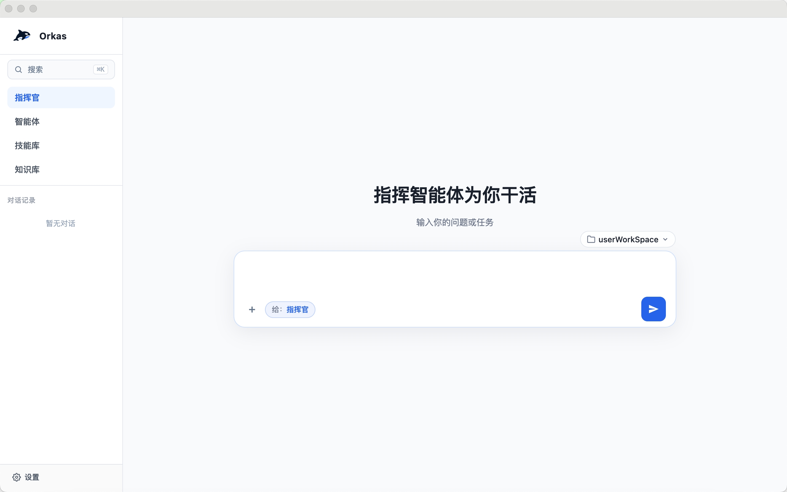
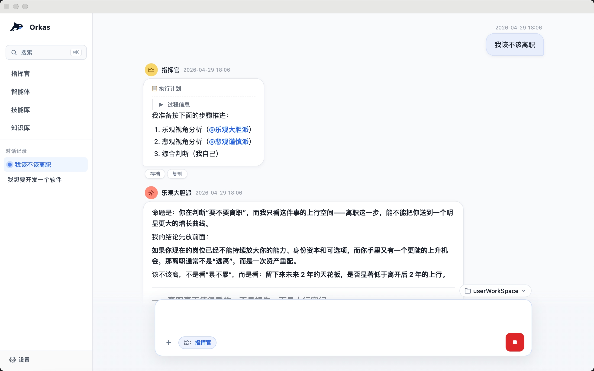
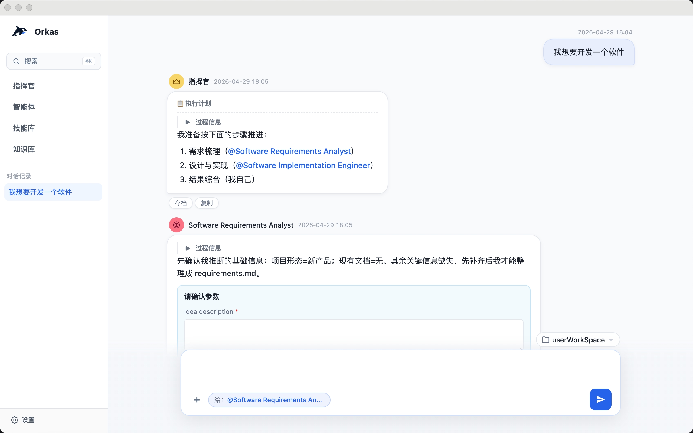
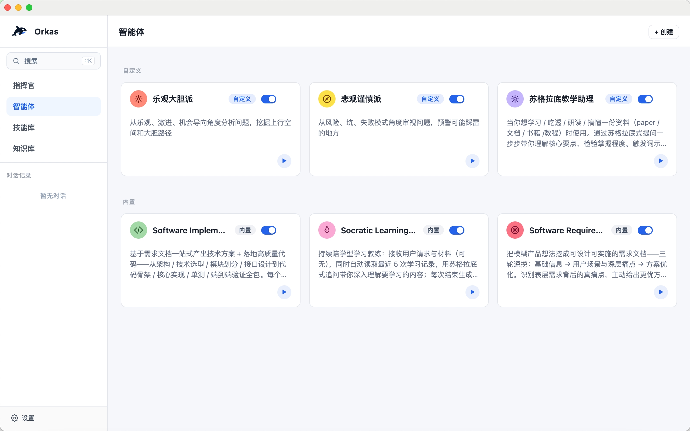
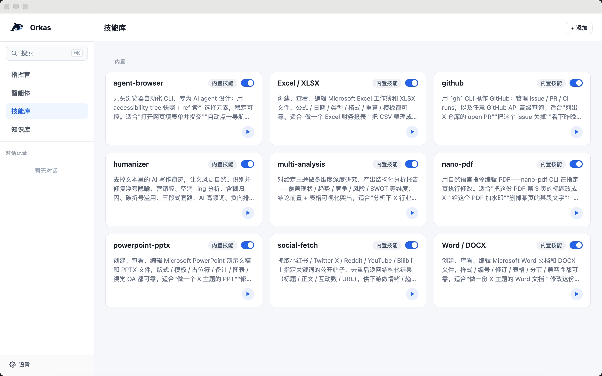

# Orkas — 开源多智能体 AI 桌面客户端

**开源的多智能体 AI 桌面客户端，做 AI 工作流编排：用一段对话组建你的 AI 团队 —— 指挥官 LLM 组装智能体团队，并行或串行调度子智能体，并让智能体通过自我反思与技能沉淀持续演进。本地优先存储，自带 LLM 密钥（Claude · OpenAI · Gemini · DeepSeek · Kimi · GLM · Qwen · MiniMax · 豆包），跨 macOS / Windows / Linux 三端。给本地 agent 加一层零代码、图形化的团队编排 —— OpenClaw、Hermes-Agent、Claude Code、Codex 等本地 CLI agent 都可以无缝接入。**

[English](./README.md) · [简体中文](./README.zh-CN.md)

> 用对话，指挥你的 AI 团队 —— 做给那些想要一支团队、而不是一个聊天框的人。

**多智能体协作 · 智能体自我演进 · 本地优先存储 · 跨平台桌面应用**

<sub>多智能体系统 · AI 团队 · 智能体团队 · AI 工作流 · 智能体编排</sub>

🌐 想要团队协作、专家 Agent 等更多功能？→ [专业版](https://aiservice.fun)

---

## 四个核心点

### 👥 多智能体协作

**一个对话框里坐着一支团队**——指挥官负责调度，智能体各做专长，你说话就行。

- **智能调度**——指挥官掌握整个对话的上下文，根据你的需求和团队成员的能力，自行决定该召集谁、什么时候召集
- **编排协作**——多个智能体在同一对话里串联或并行工作；任务拆解、智能体之间的衔接、结果汇总，全由指挥官来编排
- **快速创建智能体**——根据你的描述，或者直接从过往对话记录里提炼，指挥官会快速生成一个可复用的智能体，下次直接召唤
- **随时介入**——你可以 `@` 任何成员追加要求、重定向，或者把谁拉进来 / 踢出去

### 🌱 智能体自我演进

**让智能体越用越懂你的活**——每次任务跑完，智能体会自动复盘做得怎样、下次怎么做更好，把经验沉淀下来。

- **复盘进化**——智能体自我反思后会更新自己的工作方式：擅长 / 不擅长什么、什么场景下用什么方法
- **沉淀技能**——这次解决问题用对了的招式，智能体会把它固化成一个可复用的技能，下次同类任务直接拿来用
- **专属知识**——每个智能体有自己的私有技能库与记忆，不会被其它智能体串扰

### 💾 本地存储

**对话、文件、API key、知识库、自定义智能体 / 技能、记忆——全部留在你的机器上。**

- **离线可用**——除了调模型 API 那一刻必须联网，其它时候关掉网都能跑
- **配置即文件**——所有数据都是普通文件，可读、可备份、可接你自己的网盘做同步，迁移机器只是拷贝目录

### 🖥️ 桌面应用

**作为桌面应用，本地文件处理顺手，图形界面比命令行友好。**

- **本地文件直通**——拖拽文件进对话即附件；智能体能直接在你的工作区里读写文件、跑脚本、生成 PDF / 图片 / 代码；产出的文件在对话里以卡片呈现，一键在 Finder / 资源管理器中打开
- **可视化操作**——智能体、技能、知识库全部图形化管理；对话里直接看图片、视频、生成的文档，不用切命令行
- **用自己的会员或 API key 接模型**——OAuth 登录会员账号或填 API key，接入 DeepSeek · Kimi · GLM · MiniMax · 豆包 · Qwen · Claude · OpenAI · Gemini 等；请求 Orkas 不经手、不存档
- **跨平台**——macOS（Apple Silicon + Intel）、 Windows、Linux

---

## 产品截图

| <br>**指挥官智能调度** | <br>**智能体并行协作** |
|:---:|:---:|
| <br>**智能体串行协作** | <br>**智能体管理** |
| <br>**技能库** | |

---

## 核心设计

> 完整设计与硬约束 → [`CLAUDE.md`](./CLAUDE.md)

### 群聊：可见性切片 + 单一调度原语

一个对话里同时坐着指挥官、N 个智能体、用户，但每个智能体看到的对话**不是同一份**。

- **可见性切片**——主对话写一份全量 jsonl；每个智能体在自己的 `visibility/<aid>.jsonl` 里只拿到一个切片：`from==自己 ∨ to∋自己 ∨ mentions∋自己`。worker 只读自己的切片，**不读全量主对话**——既省 token，也防止私有上下文跨智能体泄漏
- **单一调度原语**——所有派活（指挥官的 `dispatch_to`、用户文本里的 `@`、计划拆分出的步骤）都汇到同一个 `enqueue` 原语，没有并行调度路径。新增派活方式必须经过它，避免散出"谁能唤醒谁"的混乱
- **共享 plan**——多智能体协作的进度由指挥官写在一份 `plan.md` 里，所有成员都看得到当前推进到哪一步

### 智能体调度：结构化通道，不靠消息里的 @

LLM 容易把 `@` 当 markdown 装饰打出来——在消息里识别 `@` 派活会反复误触发。所以：

- **结构化派活**——指挥官与智能体之间的派活必须走 `dispatch_to({to, message})` 工具调用，是个结构化通道；散文里的 `@` 系统不识别为派活信号（用户的 `@` 仍走文本识别，UX 不变）
- **延迟唤醒**——一次 `dispatch_to` 调用只 stage，收件人 worker 在指挥官当前 turn 完整收尾后才被唤醒，防止抢跑
- **轮次维度兜底**——死循环防护按轮次（`MAX_WORKER_TURNS=100`）而不是按时间。LLM 慢但有产出 ≠ 死循环

### 元认知自演进：meta/ + 自管技能

每个智能体在自己的目录里维护两类"自我认知"，由智能体自己写：

- **`meta/COMPETENCE.md`**——我擅长 / 不擅长什么
- **`meta/LEARNING_STRATEGIES.md`**——我用过哪些有效的方法

任务跑完后，由智能体自我反思并更新这两份文件；下次接到任务时，meta 会作为 system prompt 的一部分喂给它，**让经验真正影响下一次的行为**。

另一条进化路径是 `skill_manage` 工具：智能体可以把"这次解决 X 的招式"固化成一个**只属于自己**的技能（私有 SkillStore，独立于全局技能库）。下次同类任务直接调用，不用每次重推。

---

## 为什么选 Orkas？

Orkas 不是一个跨多个聊天平台陪着你的"个人 AI 助手"，也不是一个托管的 SaaS 平台 —— 它是一个桌面应用：你在里面组建一支专业分工的智能体团队，通过一个对话指挥它们干活。

| 工具 | 它是什么 | Orkas 的差异 |
| --- | --- | --- |
| **OpenClaw** | 在你自己的设备上跑的"个人 AI 助手"，覆盖你已经在用的各种聊天渠道。单用户、随时在线、原生入驻每个渠道 | Orkas 是桌面多智能体客户端：不是把同一个助手铺到每个渠道，而是让你组建一支专业分工的团队，在一个桌面对话里调度 —— 按 agent 切片可见性、共享 `plan.md`、每个 agent 自我演进。OpenClaw 也可作为 Orkas 的 CLI 后端接入，让 Orkas 智能体把活转交给你的 OpenClaw |
| **Hermes-Agent** | Nous Research 出的自改进个人 AI agent —— TUI + 多渠道网关，自带学习闭环、定时任务，可以跑在便宜的 VPS 或无服务器架构上 | Orkas 是桌面 GUI、团队形态：指挥官 LLM 在一个对话里并行或串行调度*一支团队*；每个 agent 有自己私有的技能库与元认知，整套栈都在你机器上本地跑。Hermes-Agent 也可作为 Orkas 的 CLI 后端接入 |
| **云端 agent 平台**（SaaS 多智能体编排） | 服务器托管，对话 / 文件 / 密钥都在厂商基础设施上 | Orkas 本地优先：对话、文件、API key、知识库、自定义智能体 / 技能 / 记忆全部留在你的机器上。模型 API 调用直接从你的机器发到模型供应商 —— 不经 Orkas 服务器，不存档 |

**Orkas 适合你**：你想要的是一支*团队*，而不是一个跨渠道陪着你的个人助手；你想要桌面 GUI 与可视化的智能体管理；你希望数据、密钥、智能体都留在自己机器上，而不是托管在某家云上。

---

## 快速开始

**要求**：Node 20+ · Python 3 · macOS / Windows 10+ / 较新 Linux

```bash
git clone https://github.com/Orkas-AI/Orkas.git
cd Orkas
./run.sh           # macOS / Linux
run.cmd            # Windows
```

`run.sh` / `run.cmd` 会自动安装依赖并下载嵌入模型（约 95 MB）。首次启动后会在 `~/.orkas/`（macOS / Linux）或 `<字母最小的非系统盘>:\.orkas\`（Windows）创建工作目录，然后**设置 → AI 模型供应商**配置 API key 或 OAuth。

---

## 致谢

项目中部分核心模块参考了以下开源项目，特别感谢：

- [OpenClaw](https://github.com/openclaw/openclaw)
- [Hermes-Agent](https://github.com/NousResearch/hermes-agent)

---

## License

[MIT](./LICENSE)
