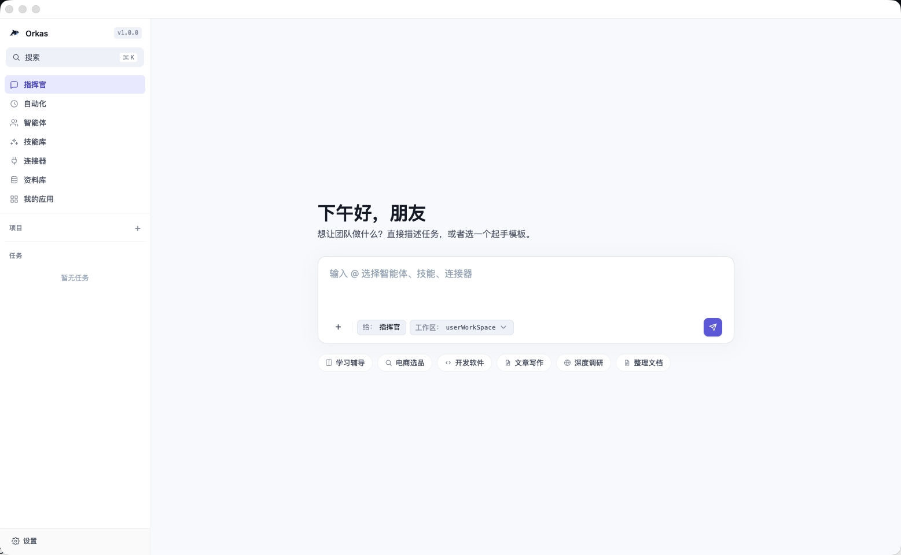

# Orkas

**开源、本地优先的 AI 工作团队，用来协同完成复杂工作。**

Orkas 是一个开源、本地优先的 AI 工作团队。一个超强**指挥官**会协调多个专业智能体，共同完成复杂工作。它是运行在 macOS、Windows、Linux 上的桌面应用；你的对话、文件、智能体配置和模型 key 默认留在本机，模型调用直连你选择的服务商。

[](./LICENSE)
[](https://github.com/Orkas-AI/Orkas/stargazers)
[](https://orkas.ai?source=gh-orkas)
[](https://orkas.ai?source=gh-orkas)
[](https://discord.gg/K8Eyvu7rD)
[](https://x.com/leochenpm)

[English](./README.md) · [简体中文](./README.zh-CN.md)


> 一个超强指挥官会把你的目标转成可执行路径，亲自处理通用工作，并在任务需要团队时协调专业智能体。无需流程图、无需编排代码。你的对话、文件和 API key 始终不离开本机。

---

## Orkas 是什么？

- **开源、本地优先的 AI 工作团队** —— 一个桌面 GUI，让你在同一个对话里指挥多个协同工作的专业智能体。不是单个聊天机器人，不是代码框架，也不是托管 SaaS。
- **超强指挥官** —— 指挥官理解上下文、拆解目标、选择合适的智能体、技能、连接器和工具；当没有更合适的专家时，也能直接处理分析、写作、调研、文件处理和自动化。
- **专业智能体共同完成复杂工作** —— 智能体可以并行或串行执行，每个智能体都有自己的技能、记忆和任务上下文，复杂工作可以跨代码、研究、数据、视频和幻灯片推进。
- **本地编排开源生态** —— 接入外部 CLI 编程智能体（Claude Code、Codex、OpenCode、Cline），并把 HyperFrames 等开源项目作为本地工具接入，全部由同一个指挥官协调。
- **本地优先设计** —— 对话、文件、API key、知识库、自定义智能体全部留在你的硬盘上。模型调用从你的机器直连服务商，绝不经过 Orkas 服务器。
- **自带大模型 key** —— 接入 Claude、OpenAI、Gemini、DeepSeek、Kimi、GLM、Qwen、MiniMax、Doubao，不同智能体可混用不同服务商，无厂商锁定。
- **自我进化的工作团队** —— 每个智能体拥有自己私有的技能与记忆，并在每次任务后通过复盘自我改进。

> ⭐ 如果 Orkas 对你有用，点个 star 能帮助更多人发现这个项目。

---

## 你能用它做什么？

- **自动化周期性报告与市场调研** —— 一个专业智能体负责收集、汇总并产出每周报告。
- **把产品需求拆成开发任务** —— 指挥官把 PRD 拆成任务，分派给多个智能体。
- **与你的文档对话、做本地数据分析** —— 拖入文件，数据全程留在本机。
- **不止于代码 —— 视频、幻灯片等** —— 指挥官可驱动 HyperFrames 等开源工具，并把任务交接给 CLI 编程智能体（Claude Code、Codex、OpenCode、Cline）及其他本地智能体，于是一个对话就能产出代码、研究、视频与幻灯片。

**查看使用场景 →** [研究工作流](https://orkas.ai/use/researchers?source=gh-orkas) · [数据分析](https://orkas.ai/use/data-analysis?source=gh-orkas) · [与文档对话](https://orkas.ai/use/chat-with-documents?source=gh-orkas) · [面向开发者](https://orkas.ai/use/developers?source=gh-orkas) · [自动化你的工作区](https://orkas.ai/use/automate-workspace?source=gh-orkas)

---

## 下载

- **获取应用** → [orkas.ai](https://orkas.ai?source=gh-orkas)（macOS · Windows 安装包）
- **从源码运行** → 见下方 [快速开始](#快速开始)（Linux 当前需使用此方式）

---

## Orkas 与同类工具对比

| 工具 | 它是什么 | Orkas 的不同之处 |
| --- | --- | --- |
| **LangChain** | 面向开发者的框架/库，用于构建 LLM 应用与智能体 —— 代码优先，嵌入你自己的 Python/JS 应用中。 | Orkas 是一个通过对话指挥的本地优先 AI 工作团队，而不是靠你写编排代码。数据与 key 默认留在本地。 |
| **CrewAI** | 一个 Python 框架，用于编排扮演角色的自治智能体 —— 你用代码定义 crew 和智能体。 | Orkas 把多智能体编排带进桌面应用，内置**本地优先存储**与每个智能体的自我进化。 |
| **云端智能体平台**（SaaS 编排器） | 服务器托管；对话、文件、API key 都存在厂商的基础设施上。 | Orkas **本地优先**：一切留在你的机器上，模型 API 调用直连服务商 —— 绝不被 Orkas 归档。 |
| **OpenClaw** | 一个常驻的单一个人助理，跨即时通讯渠道触达你。 | Orkas 提供本地优先的 AI 工作团队：指挥官在一个桌面对话里协调多个专业智能体，且 OpenClaw 可作为 Orkas 的 CLI 后端接入。 |
| **Hermes-Agent** | Nous Research 的自我改进个人智能体（TUI + 多渠道网关）。 | Orkas 是面向本地优先 AI 工作团队的桌面 GUI，每个智能体拥有私有技能与元认知 —— 且 Hermes-Agent 可作为 Orkas 的 CLI 后端接入。 |

**如果你想要的是：**一个本地优先的 AI 工作团队（而非单个助理）、一个支持拖入文件与可视化管理智能体的桌面 GUI、并希望数据/key/智能体都在自己的硬盘上而非厂商云端 —— 那么 Orkas 适合你。

**以下情况 Orkas 不适合你：**只想要一个万能单点聊天机器人、想要一个数据托管在厂商服务器上的全云端团队、或想要一个嵌入自己应用的纯代码库。

**逐项对比 →** [vs Claude Code](https://orkas.ai/compare/orkas-vs-claude-code?source=gh-orkas) · [vs Cline](https://orkas.ai/compare/orkas-vs-cline?source=gh-orkas) · [vs LangChain](https://orkas.ai/compare/orkas-vs-langchain?source=gh-orkas) · [vs ChatGPT](https://orkas.ai/compare/orkas-vs-chatgpt?source=gh-orkas) · [vs OpenClaw](https://orkas.ai/compare/orkas-vs-openclaw?source=gh-orkas)

---

## 常见问题（FAQ）

**Orkas 是什么？**
Orkas 是一个开源、本地优先的 AI 工作团队。一个超强指挥官会协调多个专业智能体，共同完成复杂工作 —— 不是单个聊天机器人，不是代码框架，也不是托管 SaaS。

**Orkas 是本地大模型吗？**
不是。Orkas 运行在你的机器上，但通过你自己的 API key（或本地模型端点）调用你选择的模型。它编排智能体与工具，本身不是模型。

**我的 API key 和数据存在哪里？**
在你的硬盘上。对话、文件、知识库、智能体和 key 都留在本地；模型调用从你的机器直连服务商，绝不被 Orkas 代理或归档。

**Orkas 能离线用吗？**
应用本身可完全离线运行 —— 只有模型调用需要网络。把智能体指向本地模型端点，就能脱离云端运行。

**Orkas 能驱动 Claude Code 等 CLI 编程智能体吗？**
能。除了自己的指挥官与专业智能体，Orkas 还能把外部 CLI 编程智能体（Claude Code、Codex、OpenCode、Cline）作为本地子进程驱动，并接入 HyperFrames 等开源项目，全部在同一个对话里指挥。

**Orkas 和 Claude Desktop / CrewAI / LangChain 有什么不同？**
Claude Desktop 是单个助理；CrewAI 和 LangChain 是代码优先的框架。Orkas 是一个本地优先 AI 工作团队：指挥官协调多个专业智能体，数据与 key 留在本地，每个智能体拥有私有技能与记忆。见[逐项对比](https://orkas.ai/compare/orkas-vs-langchain?source=gh-orkas)。

**Orkas 免费且开源吗？**
是的 —— MIT 许可证。自带模型 key，你只需为你的模型服务商付费。

---

## 快速开始

目前 macOS 和 Windows 提供安装包；Linux 用户请按照下方步骤从源码运行。

- **macOS Apple 芯片** → [Orkas-mac-arm64.dmg](https://orkas.ai/download/?source=gh-orkas&os=mac&arch=arm64&download=1)
- **macOS Intel** → [Orkas-mac-x64.dmg](https://orkas.ai/download/?source=gh-orkas&os=mac&arch=x64&download=1)
- **Windows x64** → [Orkas-Setup.exe](https://orkas.ai/download/?source=gh-orkas&os=win&download=1)

从源码运行：

**环境要求**：Node 20+ · Python 3 · macOS / Windows 10+ / 较新的 Linux

```bash
git clone https://github.com/Orkas-AI/Orkas.git
cd Orkas
./run.sh           # macOS / Linux
run.cmd            # Windows
```

`run.sh` / `run.cmd` 会自动安装依赖并下载嵌入模型（约 95 MB）。首次启动会在 `~/.orkas/`（macOS / Linux）或 `<最小的非系统盘>:\.orkas\`（Windows）下创建工作区。随后进入 **设置 → AI 服务商** 配置 API key 或 OAuth。

---

## 截图



---

## 工作原理（核心设计）

> 完整设计与硬约束 → [`CLAUDE.md`](./CLAUDE.md)

### 群聊：可见性切片 + 单一调度原语

一个对话里有指挥官、N 个专业智能体和你 —— 但**每个智能体看到的对话并不相同**。

- **可见性切片** —— 主对话是一份完整 jsonl；每个智能体只拿到属于自己的切片（`from==me ∨ to∋me ∨ mentions∋me`）。worker 永远读不到完整主对话 —— 既省 token，又防止私有上下文在智能体间泄漏。
- **单一调度原语** —— 每一次分派（指挥官的 `dispatch_to`、用户的 `@`、计划拆出的步骤）都汇入同一个 `enqueue` 原语，没有并行的路由路径。
- **共享计划** —— 多智能体协作时，指挥官把进度写进同一份 `plan.md`，对每个成员可见。

### 智能体分派：结构化通道，而非散文里的 `@`

- **结构化分派** —— 指挥官与智能体之间的分派必须走 `dispatch_to({to, message})` 工具调用；散文里的 `@` 不被识别为分派信号（用户的 `@` 仍按文本识别 —— 用户体验不变）。
- **延迟唤醒** —— 一次 `dispatch_to` 只做暂存；接收方 worker 要等指挥官当前回合结束后才被唤醒，避免过早执行。
- **基于回合的安全停止** —— 失控保护计的是回合数（`MAX_WORKER_TURNS=100`）而非墙钟时间，因此一个慢但在推进的 LLM 不会被误杀。

### 自我进化：`meta/` + 自管理技能

每个智能体在自己的目录里维护：

- **`meta/COMPETENCE.md`** —— 我擅长什么 / 不擅长什么。
- **`meta/LEARNING_STRATEGIES.md`** —— 对我有效的方法。

每次任务后智能体复盘并更新它们；下次任务时 `meta/` 会作为系统提示的一部分回喂进去，让经验真正影响下一次运行。通过 `skill_manage` 工具，智能体还能把"我是如何解决 X 的"结晶成一个**私有**技能，下次直接复用。

---

## 致谢

本项目部分核心模块参考了以下开源项目，特此致谢：

- [OpenClaw](https://github.com/openclaw/openclaw)
- [Hermes-Agent](https://github.com/NousResearch/hermes-agent)

---

## 许可证

[MIT](./LICENSE)
