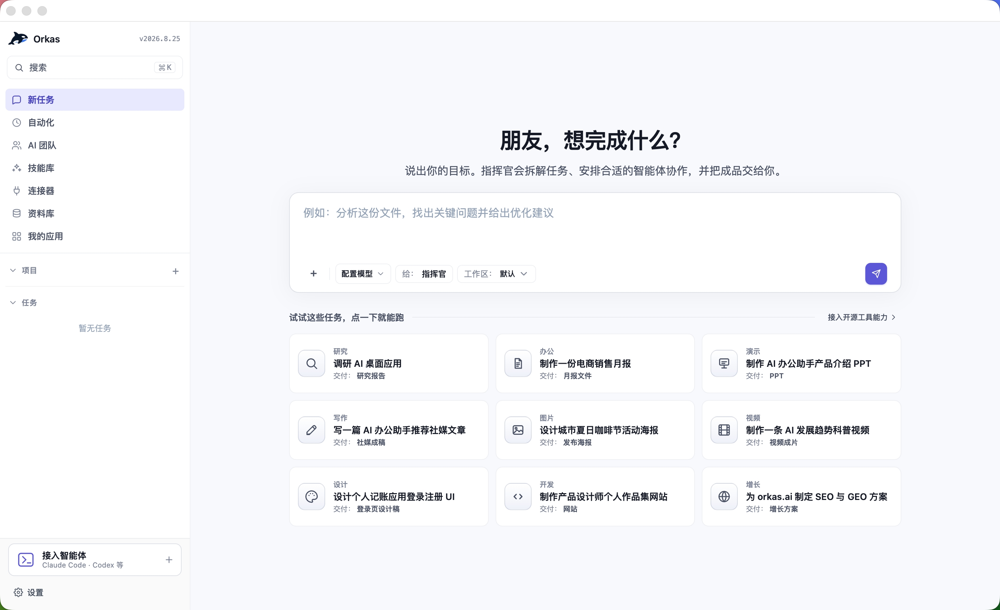

# Orkas

**在一个桌面对话里指挥一支 AI 智能体团队 —— 而不是单个聊天机器人。**

Orkas 是一个开源、本地优先的多智能体桌面应用。你描述目标，**指挥官**规划路径、亲自完成通用部分，并调度专业智能体并行或串行执行。**9 个专业智能体随应用内置**，启动即可用，marketplace 中共有 30 个。自带模型 key —— Claude · OpenAI · Gemini · DeepSeek · Kimi · GLM · Qwen · MiniMax · Doubao。支持 macOS · Windows · Linux。

[](./LICENSE)
[](https://github.com/Orkas-AI/Orkas/stargazers)
[](https://github.com/Orkas-AI/Orkas/releases)
[](https://orkas.ai?source=gh-orkas)
[](https://orkas.ai?source=gh-orkas)
[](https://x.com/leochenpm)

[English](./README.md) · [简体中文](./README.zh-CN.md)

---

**你：**“调研这个领域的 5 个竞品，写成报告，再做成一份 PPT。”

**Orkas：** 指挥官把目标拆成步骤，分派给专业智能体 —— **DeepResearcher** 检索并核验来源，**ContentWriter** 撰写报告，**PptMaker** 制作幻灯片。同一个对话、同一份计划，成品文件落在你的硬盘上。


---

## 随应用内置的智能体

首次启动 Orkas 即已安装可用，每个都有自己的技能、记忆和工具。

| 智能体 | 能做什么 |
| --- | --- |
| **DeepResearcher** | 证据型深度研究 —— 拆解问题、检索多源、核验引用、标注矛盾点，输出可复核的带引用报告 |
| **ContentWriter** | 把一句目标、资料或草稿写成可发布内容 —— 社媒成稿、文章、newsletter、教程、案例 |
| **PptMaker** | 把主题、提纲或文档做成好看、实用、可编辑、可复核的 PPTX |
| **ProductDeveloper** | 仓库级研发 —— 把 PRD、issue、bug 报告落成最小代码变更、工程测试与可审计验证 |
| **OfficeWorker** | 创建、编辑、检查并交付 Word / Excel / PowerPoint / PDF，单个或批量处理 |
| **VideoStudio** | 做视频也剪视频 —— 解说动画、AI 口播数字人、字幕配音、高光切片、本地化 |
| **ImageStudio** | 海报、封面、社媒图、信息图 —— 优先用 HTML/CSS/SVG 生成，需要时再调用图片模型 |
| **UIDesigner** | 把产品目标、PRD、截图或 Figma 材料转成以 HTML 呈现、可连续修改的 UI 设计产物 |
| **SeoGeoAgent** | 给一个 URL —— 技术审计、内容质量、核心网页指标、GEO 可引用性评分、健康分与分级行动清单 |

**了解内置智能体 →** [orkas.ai/agents](https://orkas.ai/agents/?source=gh-orkas) · **浏览全部 30 个 →** [智能体 marketplace](https://orkas.ai/views/marketplace/gs/agents/?source=gh-orkas) · 或者直接描述你的需求，让指挥官为你定制一个。

---

## 为什么选 Orkas

- **超强指挥官** —— 理解上下文、拆解目标、选择合适的智能体、技能、连接器和工具；当没有更合适的专家时，也能直接处理分析、写作、调研、文件处理和自动化。
- **驱动开源生态** —— 接入外部 CLI 编程智能体（Claude Code、Codex、OpenCode、Cline），并把 HyperFrames 等开源项目作为本地工具接入，全部由同一个指挥官协调。
- **本地优先设计** —— 对话、文件、API key、知识库、自定义智能体全部留在你的硬盘上。模型调用从你的机器直连服务商，绝不经过 Orkas 服务器。
- **无厂商锁定** —— 不同智能体可混用不同服务商：一个用 Claude，一个用 DeepSeek，一个接本地模型端点。
- **会自我进化的智能体** —— 每个智能体拥有自己私有的技能与记忆，并在每次任务后通过复盘自我改进。

> ⭐ 如果 Orkas 对你有用，点个 star 能帮助更多人发现这个项目。

---

## 下载

macOS 和 Windows 提供安装包。Linux 目前需从源码运行 —— 见 [快速开始](#快速开始)。

- **macOS Apple 芯片** → [Orkas-mac-arm64.dmg](https://orkas.ai/download/?source=gh-orkas&entry_point=github_readme&os=mac&arch=arm64&download=1)
- **macOS Intel** → [Orkas-mac-x64.dmg](https://orkas.ai/download/?source=gh-orkas&entry_point=github_readme&os=mac&arch=x64&download=1)
- **Windows x64** → [Orkas-Setup.exe](https://orkas.ai/download/?source=gh-orkas&entry_point=github_readme&os=win&download=1)

---

## 你能用它做什么？

- **自动化周期性报告与市场调研** —— 一个专业智能体负责收集、汇总并产出每周报告。
- **把产品需求拆成开发任务** —— 指挥官把 PRD 拆成任务，分派给多个智能体。
- **与你的文档对话、做本地数据分析** —— 拖入文件，数据全程留在本机。
- **不止于代码 —— 视频、幻灯片等** —— 指挥官可驱动 HyperFrames 等开源工具，并把任务交接给 CLI 编程智能体（Claude Code、Codex、OpenCode、Cline）及其他本地智能体，于是一个对话就能产出代码、研究、视频与幻灯片。

**查看使用场景 →** [研究工作流](https://orkas.ai/use/researchers?source=gh-orkas) · [数据分析](https://orkas.ai/use/data-analysis?source=gh-orkas) · [与文档对话](https://orkas.ai/use/chat-with-documents?source=gh-orkas) · [面向开发者](https://orkas.ai/use/developers?source=gh-orkas) · [自动化你的工作区](https://orkas.ai/use/automate-workspace?source=gh-orkas)

---

## Orkas 与同类工具对比

| 工具 | 它是什么 | Orkas 的不同之处 |
| --- | --- | --- |
| **LangChain** | 面向开发者的框架/库，用于构建 LLM 应用与智能体 —— 代码优先，嵌入你自己的 Python/JS 应用中。 | Orkas 是一个通过对话指挥的本地优先多智能体桌面应用，而不是靠你写编排代码。数据与 key 默认留在本地。 |
| **CrewAI** | 一个 Python 框架，用于编排扮演角色的自治智能体 —— 你用代码定义 crew 和智能体。 | Orkas 把多智能体编排带进桌面应用，内置**本地优先存储**与每个智能体的自我进化。 |
| **云端智能体平台**（SaaS 编排器） | 服务器托管；对话、文件、API key 都存在厂商的基础设施上。 | Orkas **本地优先**：一切留在你的机器上，模型 API 调用直连服务商 —— 绝不被 Orkas 归档。 |
| **OpenClaw** | 一个常驻的单一个人助理，跨即时通讯渠道触达你。 | Orkas 给你的是一支团队而非单个助理：指挥官在一个桌面对话里协调多个专业智能体，且 OpenClaw 可作为 Orkas 的 CLI 后端接入。 |
| **Hermes-Agent** | Nous Research 的自我改进个人智能体（TUI + 多渠道网关）。 | Orkas 是一个本地优先的多智能体桌面应用，每个智能体拥有私有技能与元认知 —— 且 Hermes-Agent 可作为 Orkas 的 CLI 后端接入。 |

**如果你想要的是：**一支智能体团队而非单个助理、一个支持拖入文件与可视化管理智能体的桌面 GUI、并希望数据/key/智能体都在自己的硬盘上而非厂商云端 —— 那么 Orkas 适合你。

**以下情况 Orkas 不适合你：**只想要一个万能单点聊天机器人、想要一个数据托管在厂商服务器上的全云端团队、或想要一个嵌入自己应用的纯代码库。

**逐项对比 →** [vs Claude Code](https://orkas.ai/compare/orkas-vs-claude-code?source=gh-orkas) · [vs Cline](https://orkas.ai/compare/orkas-vs-cline?source=gh-orkas) · [vs LangChain](https://orkas.ai/compare/orkas-vs-langchain?source=gh-orkas) · [vs ChatGPT](https://orkas.ai/compare/orkas-vs-chatgpt?source=gh-orkas) · [vs OpenClaw](https://orkas.ai/compare/orkas-vs-openclaw?source=gh-orkas)

---

## 常见问题（FAQ）

**Orkas 是什么？**
Orkas 是一个开源、本地优先的多智能体桌面应用。一个超强指挥官规划你的目标，并协调多个专业智能体共同完成 —— 其中 9 个随应用内置。不是单个聊天机器人，不是代码框架，也不是托管 SaaS。

**Orkas 是本地大模型吗？**
不是。Orkas 运行在你的机器上，但通过你自己的 API key（或本地模型端点）调用你选择的模型。它编排智能体与工具，本身不是模型。

**能用 Ollama、LM Studio 这类本地模型吗？**
可以。在 **设置 → AI 服务商 → 自定义（OpenAI 兼容）** 中添加，把 base URL 指向你的本地端点即可。同一个对话里，一个智能体用本地模型、另一个用云端模型也没问题。

**我的 API key 和数据存在哪里？**
在你的硬盘上。对话、文件、知识库、智能体和 key 都留在本地；模型调用从你的机器直连服务商，绝不被 Orkas 代理或归档。

**Orkas 能离线用吗？**
应用本身可完全离线运行 —— 只有模型调用需要网络。把智能体指向本地模型端点，就能脱离云端运行。

**需要注册 Orkas 账号吗？**
安装包版本在首次启动时会要求登录。本仓库的源码版本完全没有账号模块，启动后直接进入应用。两种方式下，模型 key 都是你自己的，并且留在本机。

**Orkas 能驱动 Claude Code 等 CLI 编程智能体吗？**
能。除了自己的指挥官与专业智能体，Orkas 还能把外部 CLI 编程智能体（Claude Code、Codex、OpenCode、Cline）作为本地子进程驱动，并接入 HyperFrames 等开源项目，全部在同一个对话里指挥。

**Orkas 和 Claude Desktop / CrewAI / LangChain 有什么不同？**
Claude Desktop 是单个助理；CrewAI 和 LangChain 是代码优先的框架。Orkas 是一个本地优先的多智能体桌面应用：指挥官协调多个专业智能体，数据与 key 留在本地，每个智能体拥有私有技能与记忆。见[逐项对比](https://orkas.ai/compare/orkas-vs-langchain?source=gh-orkas)。

**支持哪些平台？**
macOS（Apple 芯片与 Intel）和 Windows 10+ 提供安装包。Linux 目前从源码运行 —— 功能相同，只是还没有安装包。源码运行需要 Node 20+ 与 Python 3。

**Orkas 免费且开源吗？**
是的 —— 应用本身 MIT 许可证、免费使用。自带模型 key 时，你只需为你的模型服务商付费，Orkas 不抽成。此外，桌面版还提供一个可选的内置 **Orkas 模型**，供不想自己配置 key 的用户使用 —— 这部分由 Orkas 按 credits 计费（会员或 credits 包）。它完全可选，其余所有功能用你自己的 key 即可。[价格 →](https://orkas.ai/pricing/?source=gh-orkas)

---

## 快速开始

想直接用安装包？见上方 [下载](#下载)。以下是从源码运行的方式 —— 也是目前在 Linux 上运行 Orkas 的方式：

**环境要求**：Node 20+ · Python 3 · macOS / Windows 10+ / 较新的 Linux

```bash
git clone https://github.com/Orkas-AI/Orkas.git
cd Orkas
./run.sh           # macOS / Linux
run.cmd            # Windows
```

`run.sh` / `run.cmd` 会自动安装依赖并下载嵌入模型（约 95 MB）。首次启动会在 `~/.orkas/`（macOS / Linux）或 `<最小的非系统盘>:\.orkas\`（Windows）下创建工作区。随后进入 **设置 → AI 服务商** 配置 API key 或 OAuth。

---

## 截图



---

## 工作原理（核心设计）

> 完整设计与硬约束 → [`CLAUDE.md`](./CLAUDE.md)

### 三个派发动词，以及选哪个的规则

指挥官是唯一持有派发工具的角色 —— worker 和智能体都没有。选哪个动词，决定了用户听谁说话、以及指挥官是否留在回合里：

| 动词 | 用户看得到智能体的回复 | 结果回传给指挥官 | 指挥官的回合 |
| --- | --- | --- | --- |
| `hand_off_to({ to, message })` | 是 | 否 | 结束 —— 智能体的回复本身就是答案 |
| `dispatch_to({ to, message })` | 是 | 是 | 继续执行一个已命名的下一步 |
| `run_worker({ to, task })` | 否 —— 作为私有输入 | 是 | 继续 |

指挥官必须**先**说出自己具体的下一步动作，才可以选 `dispatch_to`；如果剩下的事只是复述智能体的回复，规则就强制它改用 `hand_off_to`。正是这一条约束，让多智能体对话不会以"把你刚读过的内容再总结一遍"收尾。在同一次回复里发出多个 `run_worker` 调用，它们会并发执行。

### 可见性切片：没有智能体能读到完整对话

对话是一份规范的 jsonl。你和指挥官读到全文；**每个智能体只拿到一个切片** —— 即它出现在 `from`、`to` 或 `mentions` 中的那些消息（[`visibility.ts`](./src/main/features/group_chat/visibility.ts)）。切片是授权边界而非重放缓冲：智能体通过限定作用域的历史工具按需取用，而不是重放别人的上下文。既省 token，也让一个智能体的私有上下文不会泄漏给另一个。

### 单一运行时，有界扇出

每个对话只有一个 FIFO 运行时，顶层回合串行通过它；并行发生在回合**内部**，以进程内嵌套派发的形式（[`bus.ts`](./src/main/features/group_chat/bus.ts)）。两个独立的信号量为它设界 —— 跨所有用户的 `globalSlots = 10`，以及用于嵌套派发的 `dispatchSlots = 4`（可用 `ORKAS_MAX_DISPATCH_CONCURRENCY` 覆盖）。

嵌套运行刻意跳过 `globalSlots`：父回合已经占着一个槽位，嵌套获取会造成"父等子"的死锁。这个捷径之所以安全，只因为派发工具专属于指挥官，信号量不可能被重入获取 —— 死锁是被构造排除的，而不是靠超时兜底。

### 四道互相独立的失控保护

- **轮次上限** —— `MAX_WORKER_TURNS = 100` 计的是回合数而非墙钟时间，因此一个慢但在推进的模型不会被误杀。
- **每回合工具轮数** —— 指挥官 120、具名智能体 100、临时 worker 用 schema 默认值（[`actor-budgets.ts`](./src/main/features/group_chat/actor-budgets.ts)），由单元测试钉死，不会悄悄漂移。
- **`loop_detection`** —— 连续 N 次相同或近似重复的工具调用后提醒模型。
- **工具空闲看门狗** —— 针对卡住而非打转的回合。

### 自我进化：由信号触发，而非每次任务都做

每个智能体维护 `meta/COMPETENCE.md`（我擅长什么 / 不擅长什么）和 `meta/LEARNING_STRATEGIES.md`（对我有效的方法），两者都会在下一次运行时回喂进它的系统提示。

复盘不是固定计数器。一个加权触发器为六个信号打分 —— `error_recovery`、`user_correction`、`complexity`、`known_weakness`、`weakness_succeeded`、`skill_ineffective` —— 只有总分越过阈值才触发复盘，并依据占主导的那个信号生成复盘提示（[`metacognition.ts`](./src/core-agent/src/evolution/metacognition.ts)）。通过 `skill_manage`，智能体还能把"我是如何解决 X 的"结晶成一份**私有** `SKILL.md`，从下一回合起即可使用。

---

## 致谢

本项目部分核心模块参考了以下开源项目，特此致谢：

- [OpenClaw](https://github.com/openclaw/openclaw)
- [Hermes-Agent](https://github.com/NousResearch/hermes-agent)

---

## 许可证

[MIT](./LICENSE)
