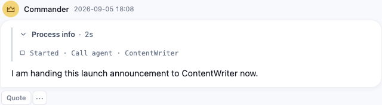

# OrkasOpen 对 Orkas 1.6.8 的逻辑核对与修复

审计日期：2026-09-05。此文记录修复及验证结果；合并状态以对应 PR 为准，合并不代表安装包已发布。

## 结论与边界

不止最初的五项。首轮只深入检查了九个会话与运行时模块，不能据此判断其他功能都正常。本轮把检查扩展到十五个模块类别，按 39 组记录修复：包括同步遗漏、两边共有的问题、开源适配不一致和检查项遗漏。这不是“39 个独立漏同步文件”的统计。

截图中的原始 Agent ID 问题在 168 与 Open 都能复现。因此它不能单独证明漏同步。修复同时补齐了事件中的身份信息和历史记录的名称回退：已知 Agent 显示名字，旧记录可从 Agent 缓存或会话成员找回名字；无法解析的内部 ID 不再冒充名称。外部 Agent 的既有名称处理保留。

实际 Electron 回归截图（测试 Agent 为 ContentWriter）：

本轮没有发现仍缺失的、应同步的生产文件；发现的是已存在文件中的逻辑、调用参数、IPC 和样式遗漏。已确认且属于保留功能的缺口已处理。这个结论不等于所有运行场景都没有缺陷，也不等于 Open 与商业版本具有全部相同能力。

## 固定比较对象

- 来源：Orkas `release_1.6.8`，提交 `99d6e1fa8`，使用 Git 对象读取内容。其 PC 树与原同步来源 `3d92d333da356aec10a2ac3865d4715fb432a1e4` 相同。
- 目标基线：OrkasOpen `b0c86654`。修复分支：`codex/fix-168-parity-20260905`。
- Orkas 工作区保持 `release_1.7.0`。没有 checkout 到 168，没有重置、暂存或清理用户的并行改动。
- 保留后续 Open 修复：流终结的幂等处理、日志脱敏、Codex 登录输入、公开 Orkas API、收窄的失效 CLI 会话匹配和 Linux 支持。没有整体覆盖经过适配的主进程、设置页或媒体服务。

## 覆盖方法

先检查原同步区间的 1,592 个清单项及其排除/适配记录，再独立枚举固定 168 与 Open 的源码、启动脚本、配置及相关核心文件。后者并集为 701 个路径：基线字节相同 407 个、有差异 162 个、Open 独有 14 个、排除 118 个。未出现应保留的 source-only 生产文件。

162 个差异路径按下表检查共享逻辑；明确排除的账号、积分等大块内容按职责和调用边界归类，没有把它们当成待恢复功能。表中数量用于解释文件覆盖范围，不是测试覆盖率，也不是缺陷数量。

| 模块 | 相同 | 差异 | Open 独有 | 排除 | 核对重点 |
| --- | ---: | ---: | ---: | ---: | --- |
| Agent | 1 | 2 | 0 | 1 | 详情入口、返回来源、编辑权限和保存 |
| 应用支持 | 100 | 28 | 4 | 55 | 配置存储、发布回调、生命周期和公共工具 |
| 自动任务与通知 | 5 | 2 | 0 | 1 | 调度、终止通知、持久化与用户归属 |
| Connector | 18 | 13 | 2 | 6 | OAuth、刷新并发、MCP 发现和调用 |
| 会话 | 13 | 10 | 0 | 0 | 流处理、队列、Stop、重开、Agent 交接 |
| 外部 Agent | 24 | 5 | 0 | 0 | CLI 配置、会话恢复、原生模型请求 |
| 文件与保存应用 | 20 | 12 | 0 | 3 | 附件、预览、产物、保存、回收站 |
| 知识库 | 10 | 3 | 0 | 1 | 入库、图片描述、索引与 Office 预览 |
| Marketplace | 7 | 4 | 0 | 3 | 浏览、安装、详情、只读边界 |
| 模型与媒体供应商 | 9 | 17 | 0 | 1 | 凭据、迁移、请求、取消、媒体下载 |
| 原生与启动 | 34 | 17 | 7 | 19 | 代理、原生依赖、启动、退出、打包配置 |
| 项目与任务 | 10 | 5 | 0 | 0 | 项目归属、文件、任务和工作区 |
| 运行时与工具 | 79 | 15 | 0 | 2 | 工具可见性、参数、权限、恢复和结果 |
| 设置与界面 | 54 | 27 | 1 | 24 | 页面生命周期、异步结果、DOM、样式、语言 |
| Skill | 23 | 2 | 0 | 2 | 安装、编辑、系统 Skill 和读取范围 |

计数说明：基线枚举使用当前同步规则记录 Open 的后续能力；另与固定 168 规则逐项复核。只有两个视频生产文件的排除分类不同：168 明确排除商业视频实现，Open 后续新增了自己的公开 API 实现。这两个文件已作为 Open 实现单独检查，没有误判成必须照搬商业适配器。

其他交叉核对：

- IPC：检查静态可识别的 renderer 调用与主进程注册表。补齐五个有效入口后，剩余五个未注册引用属于禁用的开发/上传功能；不是用户可达的缺失入口。动态生成的调用仍由所属功能测试覆盖，静态扫描不声称覆盖所有运行时值。
- renderer 名称绑定：检查新增未声明引用，修复有效路径上的 `trackResult`；剩余诊断属于已禁用的开发/遥测分支、受 `typeof` 保护的可选入口或既有隐式变量，未计为新的可达故障。
- HTML/CSS：比较 DOM ID 与逐个 CSS 选择器，避免把合并选择器、格式化差异或已删功能样式当成遗漏；恢复 117 个共享组件选择器条目及相关声明。这些条目不是 117 个独立缺陷。Library 默认三列样式也对齐到四列，但运行时本来就会按标签数重设列数，因此没有把它计为独立的可见故障。
- 文本：核对 en/zh/ja/pt 四份语言文件。共同删除的 268 个键主要属于已排除功能，附件提示等仍有效的差异已恢复；新增旧视频配置不可用的说明。
- 内置资源：286 个来源文件、7 个 Open 覆盖、1 个排除的系统 Skill，未发现应保留资源缺失。另检查目标 manifest。
- 依赖：锁文件 521 个 package 记录相同、63 个不同、56 个移除、10 个新增；核对商业依赖移除、Linux tokenizer 适配及工具链解析版本差异。保留 Open 的锁文件，没有降级或重新安装依赖。这不是依赖漏洞审计。

## 修复记录

| ID | 问题与处理 | 主要实现/证据所属模块 |
| --- | --- | --- |
| F1 | 委派过程显示内部 ID；补齐事件身份字段和实时/历史名称回退。此问题两边共有 | `event-mapper.ts`、`conversation.js`；事件和重放用例 |
| F2 | 从消息头像/名称、创建结果打开 Agent 详情时返回目标未定义；在导航前捕获来源，查找失败保持当前页 | `agents.js`；详情返回导航用例 |
| F3 | 子 Agent 交接错误复用了展示过滤后的产物列表；交接保留真实文件，页脚仍可隐藏过程文件 | `group_chat/bus.ts`；真实文件交接用例 |
| F4 | 发送未启动或抛错后残留 Stop 恢复快照；按控制器归属清理，保留排队/运行中的快照 | `conversation.js`；发送失败和队列对照用例 |
| F5 | `generate_video` 缺少专用过程文案；恢复实时与历史本地化呈现 | `conversation.js`；过程展示用例 |
| F6 | 知识库图片描述漏设空工具列表 | `library_image_describer.ts`；调用参数用例 |
| F7 | Marketplace Agent 编辑记忆时定义字段未保持只读 | `agents.js`；资源编辑用例 |
| F8 | Agent/Skill 编辑会话漏设仅错误消息操作 | `agents.js`、`skills.js`；控制器创建用例 |
| F9 | 流式 Skill 编辑缺少专用系统 Skill、空普通 Skill 列表和只读目录 | `features/skills.ts`；流式编辑参数用例 |
| F10 | 搜索响应正文、参考图下载缺少完整超时/取消与大小边界 | `search-adapters.ts`、`generation_reference_assets.ts`；正文停滞和下载用例 |
| F11 | PDF 已写入，但产物登记回调抛错使工具整体失败 | `local-tools.ts`；成功落盘后回调失败用例 |
| F12 | OAuth 普通/强制刷新可能并发重复，失败状态不及时，部分 Server grant 不刷新 | Connector manager/OAuth；刷新并发与认证恢复用例 |
| F13 | Agent 保存和 Skill 重命名残留未声明的遥测回调，中断后续状态更新 | Agent/Skill renderer；真实保存与重命名路径 |
| F14 | Connector 目录缺少轻量清单、按名展开与大目录压缩 | `connector-meta-tools.ts`；目录大小和懒加载用例 |
| F15 | Connector 调用丢失取消信号、MCP 错误标记及 schema 限定的参数别名 | `connector-meta-tools.ts`；取消/错误/参数冲突用例 |
| F16 | OAuth 明确错误码被含“取消”的文案掩盖 | `connectors.js`；错误码优先级用例 |
| F17 | 原生 pi provider 缺失推理、请求头、延迟工具和返回详情等处理 | `pi-provider.ts`；恢复对应 provider 行为用例 |
| F18 | 外部 provider 缺少 Moonshot 原生路径及部分推理消息修复 | `external-providers.ts`；实际请求构造用例，保留公开 Orkas API |
| F19 | 主进程未安装全局系统代理路由 | `main/index.ts`；真实 Electron 启动后通过本地代理访问虚构域名 |
| F20 | Office 常驻进程启动/退出清理及重复退出合并遗漏 | `main/index.ts`；保留 Open 生命周期上报，测试启动隔离 |
| F21 | 目录与导入选择器丢失合理默认位置 | 主进程 IPC；实际注册处理器与 dialog 参数用例 |
| F22 | Agent 记忆增改删、知识库/项目 Office HTML 预览五个有效 IPC 未注册；创建 Agent 也补传 profile | 主进程 IPC；记忆落盘、预览所属组件用例 |
| F23 | 图像/视频请求只约束响应头，缺少部分取消、进度和结果校验 | `image_gen.ts`、`video_gen.ts`；四类图像调用、无效字节、响应头后取消/超时 |
| F24 | 图像工具遗漏项目附件路径、引用角色、生产计划、预算/复用/事务及版本化产物 URL；媒体异常需保留未决事务 | 图像/视频工具；生产控制和文件边界用例；不引入商业积分 |
| F25 | 本地默认图像模型和编辑能力字段归一化遗漏 | `client_config.ts`；默认值与两种字段形式用例 |
| F26 | 初始化用户未恢复 uid/未读状态，视图切换过早启动队列 | `boot.js`；用户初始化和队列时序用例 |
| F27 | 工作区选择/重置把失败、取消、持久化后刷新失败混为一谈 | `user-workspace.js`；各结果分支用例 |
| F28 | 设置控件绑定过晚、模型变更事件/缓存刷新遗漏，删除和打开数据目录结果处理不完整 | `settings.js`；延迟 IPC 与设置交互用例 |
| F29 | 回收站恢复后不刷新 Agent/Skill 缓存，刷新失败又被报成恢复失败 | `settings.js`；恢复成功与后续刷新失败用例 |
| F30 | 凭据写入不原子，损坏存储可能被后续操作覆盖；迁移写失败会丢失可读结果 | `auth.ts`；加密存储、原子失败、损坏文件保留用例 |
| F31 | OAuth 过期/刷新失败状态不完整，SDK 连接错误可暴露密钥 | `auth.ts`；刷新恢复和错误脱敏用例 |
| F32 | 模型选择/重排缺少单次原子保存与不可用项稳定顺序，自定义端点模型不应被改写 | `auth.ts`；保存次数、固定模型和排序用例 |
| F33 | 退役模型别名升级、入口去重和持久化迁移遗漏 | `auth.ts`、`provider_catalog.ts`；迁移前后读取与保存用例 |
| F34 | provider 轮转遗漏成功回退后的本轮失败候选抑制、图片省略提示去重与终止类别 | `rotating-provider.ts`；成功/全失败轮转和提示用例 |
| F35 | 语言切换、OAuth 启动 IPC 抛错未恢复界面并明确反馈 | `settings.js`；失败和恢复用例 |
| F36 | 图像设置忽略 IPC 返回的具体模型选项，无法正确选择新增模型 | `settings.js`；选择 Seedream Pro 后实际保存参数用例 |
| F37 | 视频设置允许添加未实现的 Doubao 适配器；限制新增到实际支持的公开 API，旧配置保留并显示不可用 | `video_auth.ts`、IPC、设置页；旧密钥保留/移除与 UI 状态用例 |
| F38 | 队列删除、视频重试/审阅、CLI 设置、Office 自适应、按钮焦点等共享样式丢失；两处 Skill 关闭控件缺少按钮语义 | `style.css`、`index.html`、语言文件；四标签布局与审阅面板端到端检查 |
| F39 | 常规 typecheck 没有执行核心 Agent 的严格配置 | `package.json`；主项目和核心 Agent 两道检查均执行 |

F24 是有意恢复模型可见参数，并非描述清理：新增 `reference_image_urls`、`reference_bindings`、`negative_prompt`、两个视频生产标识和两个 ImageStudio 标识；原必填 `prompt` / `output_path` 不变。所属行为测试通过后更新了工具 schema 指纹，保留参数语义和描述预算检查。

## 保留的产品差异

- Open 不包含商业账号登录、会员/积分、云同步、官方自动更新、服务端语音输入、私有分享/反馈和开发发布面板。这些不列为漏同步。
- Open 使用用户密钥的公开 Orkas API；其视频请求协议和实现由 Open 自己维护。没有补入商业版的 MiniMax、Vidu、Kling、Google、Runway 等视频适配器。Doubao 视频的“可配置但不可执行”矛盾已修复，尚未新增其执行能力。
- 保留开源 Connector bridge、独立数据目录、Linux 源码启动/原生依赖和本地回收站展示。商业管理能力不通过同步恢复。
- 相同源码仍可能共有缺陷，F1 就是实例。对未发生差异的函数没有宣称逐函数重新证明其正确性。

## 验证结果

完整基线在修改前通过：主项目类型检查，8,461 个 JS 用例/15 个跳过，415 个资源用例，E2E 类型检查，142 个桌面 E2E 场景，当前平台原生测试 1,017 个通过/12 个跳过，以及 smoke。

| 检查 | 最终结果 |
| --- | --- |
| 主项目与核心 Agent 严格类型检查 | 通过 |
| 完整 JS 单元测试 | 553 个文件通过；8,605 个用例通过，15 个条件跳过，0 失败 |
| 资源测试 | 415 个通过，0 失败；1 个既有 Python SSL 环境告警 |
| 桌面 E2E 类型检查 | 通过 |
| 桌面 E2E | 144 个不同场景具有通过记录：完整运行 142 通过、1 个夹具时序失败；修正夹具并复验 18 个受影响/新增场景，全部通过 |
| 当前平台原生测试 | macOS：33 个文件通过；1,020 个通过，12 个条件跳过，0 失败 |
| smoke / builtin manifest | 通过 |

最后一轮完整 JS/资源测试在桌面复验结束后串行运行；其启动时记录了所有 `src/` 与 `test/` 文件的哈希，结束时检查没有变化。结构化结果见 [验证记录](2026-09-05-168-verification.json)。

验证过程中修正了旧代理初始化禁止断言，审核并更新图像工具 schema 指纹/描述断言；另外调整了测试夹具：队列编辑要等实际流结束，进程树测试要留出 Electron 子进程启动时间，并原子发布 PID 文件。没有通过跳过失败用例、删除进程清理断言或增加自动重试来取得最终结果。曾在增补测试期间发生的旧模块缓存与新用例混用，已由固定源码的最终串行完整运行排除。

定向回归覆盖实时与重放、旧数据、异常/取消、落盘后回调失败、并发刷新、provider 回退和真实 IPC。模型请求使用本地协议夹具或测试替身，没有调用用户真实付费模型或使用真实 OAuth 密钥。Electron E2E 使用隔离的临时数据目录，验证实际 renderer/preload/IPC/文件和本地模型协议链路。

限制：本机为 macOS，未在 Windows/Linux 真机重跑；没有执行每一家供应商的真实付费 API、真实账号登录、真实系统通知展示或完整签名安装包发布。平台条件和可选外部资源用例的跳过单列，不算通过。日志中的 Python LibreSSL、Node API 弃用提示及故意触发的错误分支不作为零告警证明。

原始比较快照、差异、红/绿回归日志与全量日志存于本次任务的临时审计目录 `orkas168-compare-pquxtkcw`；本文件及仓库中的行为测试是持续保留的审计入口。
